## Mandatory external components

### Storage

OKDP does not provide storage and an s3 storage provider must be brought beforehand to the platform. OKDP communicates through an API to the storage provider. Any s3 storage provider that also performs STS should be compatible with OKDP; here, for the demonstration purpose, SeaweedFS is being used.

A database server controller whether it uses Postgres or another DBMS must be provided too.

Once the storage provider and the database-server controller are present, OKDP communicates with them through connections explained later on.

How to create a view of the storage provider's user interface is shown in the [user guide](../user-guide/index.md#project-panel).

The storage provider as well as the database server controller must be provided through a kubocd package with `storage` or `database-server` marked in their metadata. Otherwise, some services depending on them are undeployable.

### Ingress controller

An Ingress controller must be installed to access the user interfaces of all services and the OKDP control plane itself. For the v1 of OKDP, Nginx is being used, knowing that it is deprecated; however, migration to other ingress controllers will be applied later on.

### Identity Provider

OKDP currently works and has been tested with [Keycloak](https://www.keycloak.org/) and [KubeAuth](https://www.kubeauth.io/) for OIDC authentication. Please refer to their documentation for any further information.

## Projects

Projects are Kubernetes [namespaces](https://kubernetes.io/docs/concepts/overview/working-with-objects/namespaces/) containing the label `okdp.io/project` isolating the application services deployed within from the ones in the other projects. It is not possible to bind two services in different namespaces. Trino, for instance, cannot communicate with a Hive metastore from another project.

The name of the project is the name of the namespace.

Here is an example of a project in YAML format:

```yaml
apiVersion: v1
kind: Namespace
metadata:
  name: demo
  labels:
    okdp.io/project: demo
  annotations:
    okdp.io/description: Demonstration project, full data chain
```

To create a new project with the user interface, click on the top left button indicating your current project and then on `all projects`. Here, all your projects are listed, and you can create a new one by clicking on `+ Create project`. A window will open, and you will give the project name, optionally a description and choose a font color, which you can later on change, and click on `CREATE`.

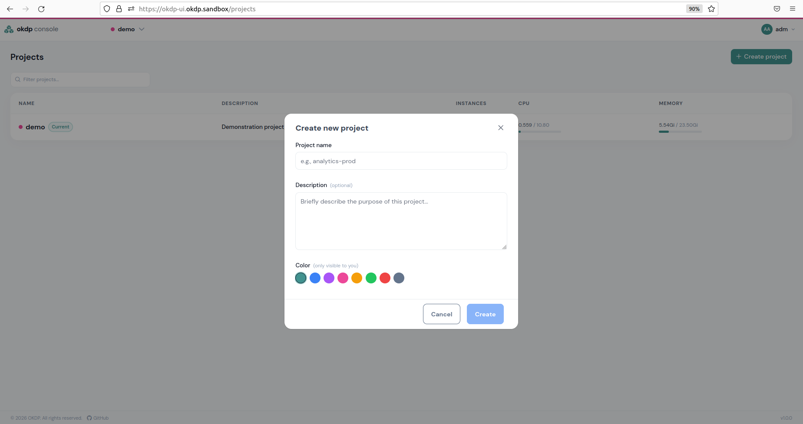

You may then switch between the projects by clicking on the top-left tab indicating your current project name and choosing between all created projects.

To permanently delete a project, go to `Project Panel` -> `Settings` and in the section `Delete this project` click on `Delete`. The permanent deletion will be executed after you confirm it.

Note: deleting a project corresponds to the deletion of the namespace. All instances and objects within the namespace will be deleted with it and cannot be retrieved.

## Connections

A connection is a Kubernetes object brought by the Kubocd controller. They serve as a binding object between two services or to a storage or database provider.

Here is an example in YAML format of a connection:

```yaml
apiVersion: kubocd.kubotal.io/v1alpha1
kind: Connection
metadata:
  name: demo-storage
  namespace: demo
spec:
  contract: s3
  description: Platform S3 store, shared with this project
  values:
    apiUrl: https://storage-default-api.okdp.sandbox
    internalUrl: http://storage-s3.default.svc.cluster.local:8333
    region: us-east-1
    pathStyle: true
    secretRef: creds-seaweedfs-s3
```

In the user interface, the connection section is found under `Project Panel` -> `Connections` and brings you to the following page:

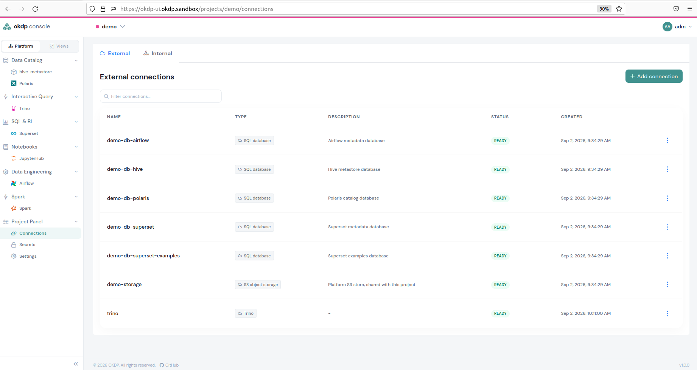

### Connection types

You may choose between several types of connections. Two types concern external components mentioned before:

- `S3 object storage`
- `SQL Database`

And three OKDP services:

- `Hive metastore` for thrift connections to the Hive metastore
- `Iceberg Rest Catalog` being a connection to Polaris
- `Trino`

Choosing between these different types determines the other parameters to enter in order to establish a connection.

### Creating connections

To create a connection with the user interface, you click on `+ Add connection`, give it a name, and choose a type. Then fill the mandatory fields and click on `Create`.

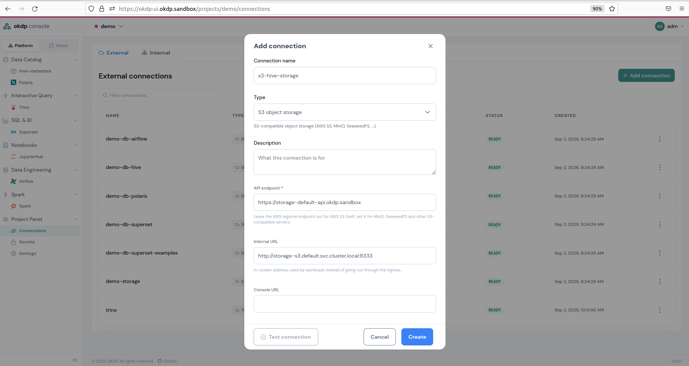

By clicking on the connection, you will have access to its details. The three dots on the right-hand side of the connection line give you the choice to edit or remove the connection.

Note: Created connections through the command line are also displayed in the user interface and may be manipulated from there on.

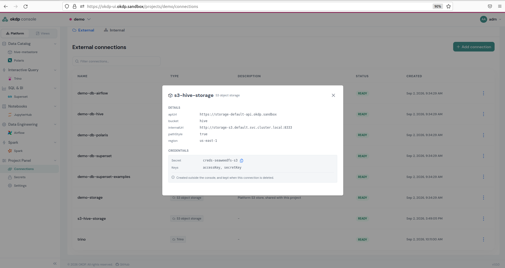

## Add a secret store and add external secrets

The OKDP control plane enables you to access secrets stored inside a secret store and produce a Kubernetes secret. The underlying component is the External Secrets Operator, which must be installed. In order to accomplish this task, a connection to a secret store must first be established. Then, you will be able to synchronize and access the desired secret within the secret store to use for OKDP services.

### Add a secret store

The OKDP control plane has been tested with Vault as a secret store, and it will be taken as an example in this case.

This operation creates a `secretStore` object from the External Secrets controller.

To create a secret store in the OKDP control plane, go to `Project Panel` -> `Secrets` -> `Secret Stores`, then click on `+ Add secret store`.

Fill the mandatory fields:

- `Store-name`, a name you give for the secret store connection.
- `Server URL`, the secret store's URL.
- `Secret path`, the path within the secret store where the secrets of interest are stored.
- `Authentication`, choose between `Token` where you paste the secrets store's authentication token or `Kubernetes` where you use a Kubernetes secret.
- `CA bundle`, if necessary paste the encoded CA bundle.

Then, if you click on `Test Connection` to test the communication between the OKDP control plane and the secret store, and if it does work, click on `Create`.

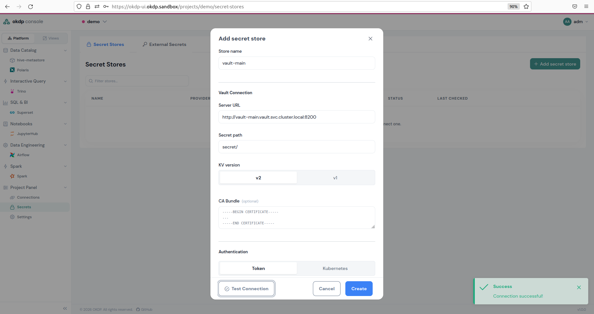

Here are the details of the secret store in YAML format that was just created, displayed with the `kubectl get secretStore -n demo vault-main -o yaml` command:

```yaml
apiVersion: external-secrets.io/v1beta1
kind: SecretStore
metadata:
  creationTimestamp: "2026-09-03T08:10:37Z"
  generation: 1
  name: vault-main
  namespace: demo
  resourceVersion: "185959"
  uid: c9868bd6-6d9b-4465-abd8-6698de6906cb
spec:
  provider:
    vault:
      auth:
        tokenSecretRef:
          key: token
          name: vault-main-credentials
      path: secret/
      server: http://vault-main.vault.svc.cluster.local:8200
      version: v2
status:
  capabilities: ReadWrite
  conditions:
    - lastTransitionTime: "2026-09-03T08:10:37Z"
      message: store validated
      reason: Valid
      status: "True"
      type: Ready
```

### Add an external secret

To create a Kubernetes secret from a secret stored in the secret store through the OKDP control plane, go to the `External Secrets` section, which is the tab next to the `Secret Store` tab, and click on `Add external secret`.

Fill in the following fields:

- `Name` which will be the name of the Kubernetes secret.
- `Secret Store` being a secret store connection that has been created as shown previously.
- `Refresh interval` being the elapsed time before synchronizing with the secret store.
- In the `Data Mappings` section:
  - `SECRET KEY` being the key to the secret's value.
  - `REMOTE KEY` being the external secret's name in the secret store.
  - `PROPERTY` being optional and adding information about the secret.
- `Kubernetes secret name` is by default the same as the external secret name but can be modified.

Then click on `CREATE`.

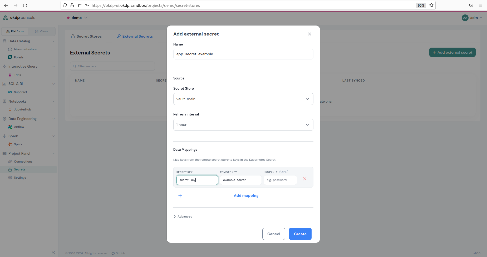

The `externalSecret` object has been created as follows:

```yaml
apiVersion: external-secrets.io/v1beta1
kind: ExternalSecret
metadata:
  creationTimestamp: "2026-09-03T13:49:51Z"
  generation: 2
  name: app-secret-example
  namespace: demo
  resourceVersion: "281555"
  uid: 972b7dd9-1fa5-412d-a312-7da6c76e925f
spec:
  data:
    - remoteRef:
        conversionStrategy: Default
        decodingStrategy: None
        key: example-secret
        metadataPolicy: None
      secretKey: secret_key
  refreshInterval: 1h
  secretStoreRef:
    kind: SecretStore
    name: vault-main
  target:
    creationPolicy: Owner
    deletionPolicy: Retain
    name: app-secret-example
status:
  binding:
    name: app-secret-example
  conditions:
    - lastTransitionTime: "2026-09-03T13:53:45Z"
      message: secret synced
      reason: SecretSynced
      status: "True"
      type: Ready
  refreshTime: "2026-09-03T13:53:45Z"
  syncedResourceVersion: 2-2f2c636d06132f67992c15a1daeb0a5f
```

The synchronization takes place, and once it is ready, the status should be `Synced`.

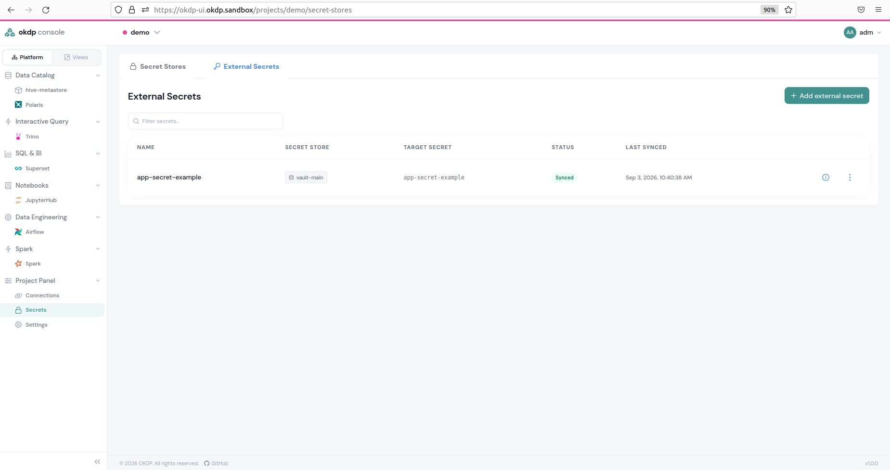

Now, if you look in your terminal, if a secret with the same name exists in your project namespace, you will see the following:
The OKDP control plane has been tested with Vault as a secret store, and it will be taken as an example in this case.

This operation creates a `secretStore` object from the External Secrets controller.

To create a secret store in the OKDP control plane, go to `Project Panel` -> `Secrets` -> `Secret Stores`, then click on `+ Add secret store`.

Fill the mandatory fields:

- `Store-name`, a name you give for the secret store connection.
- `Server URL`, the secret store's URL.
- `Secret path`, the path within the secret store where the secrets of interest are stored.
- `Authentication`, choose between `Token` where you paste the secrets store's authentication token or `Kubernetes` where you use a Kubernetes secret.
- `CA bundle`, if necessary paste the encoded CA bundle.

Then, if you click on `Test Connection` to test the communication between the OKDP control plane and the secret store, and if it does work, click on `Create`.


Here are the details of the secret store in YAML format that was just created, displayed with the `kubectl get secretStore -n demo vault-main -o yaml` command:

```sh
kubectl get secret -n demo app-secret-example
NAME                 TYPE     DATA   AGE
app-secret-example   Opaque   1      52s
```

Once you delete the external secret in the OKDP control plane, the Kubernetes object will disappear as well.

## Service Catalog customization

The OKDP control plane enables you to add, remove, and edit services in the service catalog. By clicking on the top right on your username, then on `Administration` -> `Service Catalog`. You will be redirected to the following page with all current services listed in your catalog:

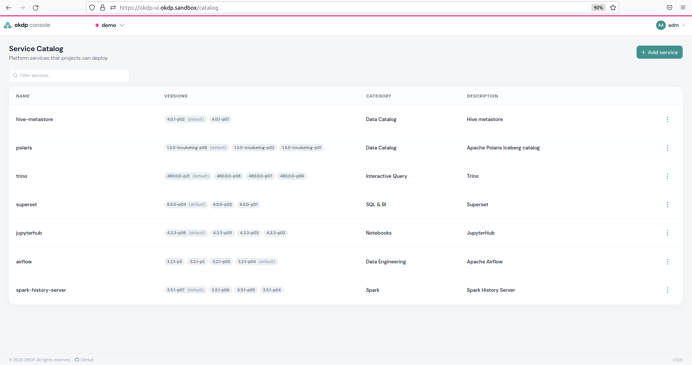

On each service line, the three dots at the right enable you to edit or delete a service. To add a service, click on the top right `+ Add service` button. You then have to give a service name, a version for the service, and the kubocd package repository where it is located. The other fields are optional, and by clicking on `Add service`, it will appear in the list.

## Service deployment

The OKDP control plane enables the administrator to deploy, delete, and monitor services, being its main goal.

A service in OKDP is a KuboCD release that has a `helmRelease` as an underlying layer. In addition to the latter, values traditionally found in the `values.yaml` can dynamically be set or modified for a deployment. A KubOCD release may contain several Helm charts with a dependency order defined between them.

Service deployment in the user interface always follows the same pattern. On the instance page of the service, click on `Deploy` and then 3 stages will follow:

1. Choose the instance name and kubocd package version for the instance.
2. Configure the instance parameters.
3. Approve the recapitulation of the configuration.
4. You are returned to the instance page of the service, where you can check the instance status.
5. By clicking on the little eye icon on the right of your instance line, you will be redirected to a page with all the instance details and its deployed pods and their state, and you are able to observe them by clicking on the `Logs` button.

A full example is given with the first-mentioned service, Hive Metastore. For the other services except Trino, the deployment configuration is given in YAML format, which can be executed through a `kubectl apply` command.

Each instance of a service may be edited by clicking on the little crayon at the right of the instance line of the instance page or permanently deleted by clicking on the dustbin.

### Order and dependencies of services

As dependency order between Helm charts within a KubOCD release representing a service may occur, there can also be a dependency order between services and thus KubOCD releases. Almost all services need either or both a storage provider and a database server delivered as a kubocd package under the dependency names `storage` and `database-server` marked in their metadata in order to deploy.

### Deploying Hive Metastore

Hive Metastore depends on a connection with an S3 storage provider and a database server. If none of them exist, the deployment will not be possible.

Otherwise, deploying a Hive Metastore instance is straightforward. In the `Data Catalog` click on `hive-metastore`, then on `+ Deploy`. Choose an instance name and a Hive Metastore kubocd package version and click on `Next`.

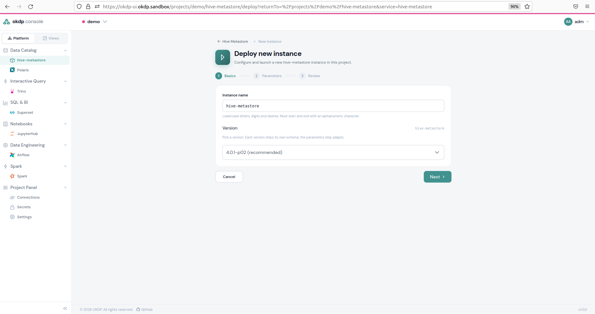

Then, select a connection to the database base server and a connection to the s3 storage provider. If they do not exist, they can be created by clicking on `+ New connection` and following the steps described previously. Enter the resource amounts and choose a Kubernetes secret for the S3 storage authentication as well as optionally a bucket to which the Hive Metastore access will be limited. Once it is done, click on `CREATE`.

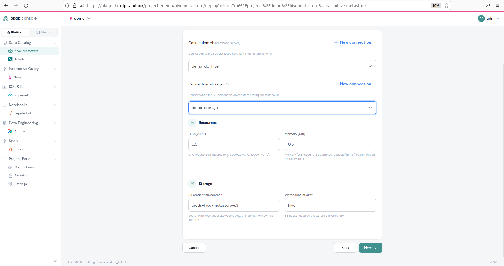

Now check that the configuration meets your expectation and click on `Deploy instance`.

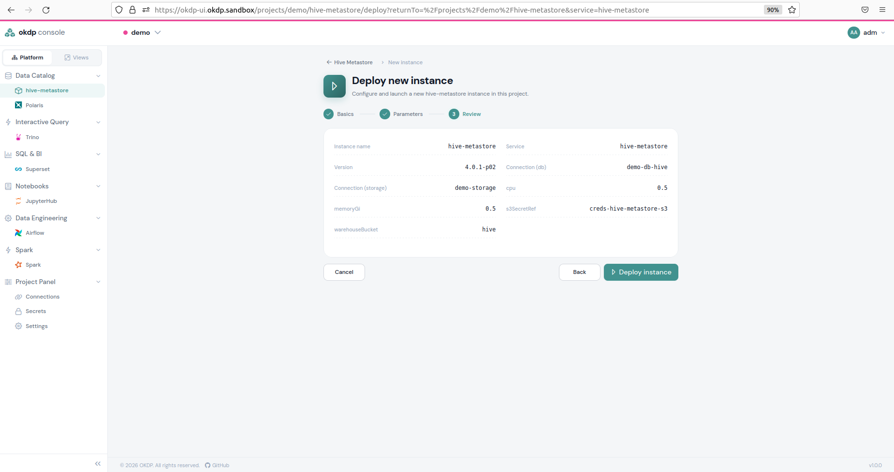

Wait for the `Status` to be `READY`.

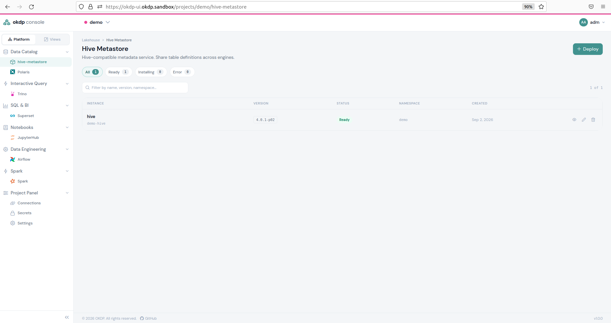

You may access the instance details by clicking on the little eye icon on the right, and you will see the deployed pods as well as their status, and you may access their logs.

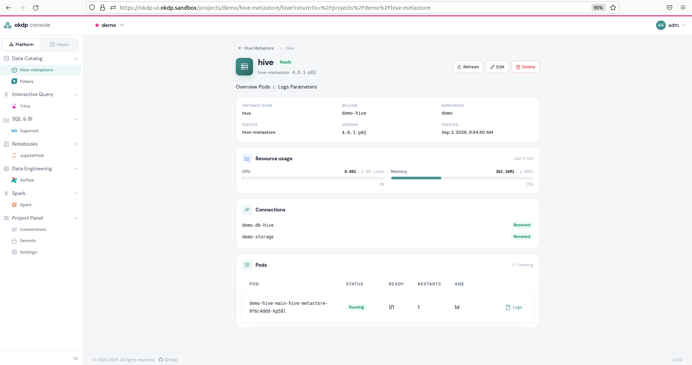

You may edit or delete the instance by clicking on the little crayon icon or the dustbin icon.

Here is the same deployment shown in the screenshots in YAML format.

```yaml
apiVersion: kubocd.kubotal.io/v1alpha1
kind: Release
metadata:
  name: demo-hive
  namespace: demo
  labels:
    okdp.io/project: demo
    okdp.io/service: hive-metastore
    okdp.io/instance-name: hive
spec:
  description: Hive metastore of the demo project
  package:
    repository: quay.io/okdp/platform-packages/hive-metastore
    tag: 4.0.1-p02
    interval: 30m
    timeout: 10m
  parameters:
    db: demo-db-hive
    storage: demo-storage
    s3SecretRef: creds-hive-metastore-s3
    warehouseBucket: hive
  targetNamespace: demo
```

### Deploying Polaris

Polaris needs a connection and the credentials to the S3 storage and a connection to an SQL database. In addition, at least one realm must be configured.

Note that the Polaris principal is used through the management API. Polaris does not authenticate Keycloak clients; it keeps its own principals.

```yaml
apiVersion: kubocd.kubotal.io/v1alpha1
kind: Release
metadata:
  name: demo-polaris
  namespace: demo
  labels:
    okdp.io/project: demo
    okdp.io/service: polaris
    okdp.io/instance-name: polaris
spec:
  description: Polaris Iceberg catalog of the demo project
  package:
    repository: quay.io/okdp/platform-packages/polaris
    tag: 1.3.0-incubating-p06
    interval: 30m
    timeout: 10m
  parameters:
    db: demo-db-polaris
    storage: demo-storage
    s3SecretRef: creds-polaris-s3
    realms:
      - name: sandbox
        rootPrincipal:
          name: root
          credentialsSecret:
            name: creds-polaris-root-okdp-sandbox
            clientIdKey: client_id
            clientSecretKey: client_secret
        principals:
          - name: service-account-svc-polaris-api-admin
            clientId: svc-polaris-api-admin
            credentialsSecret:
              name: creds-polaris-oauth2-admin-okdp-sandbox
              clientIdKey: client_id
              clientSecretKey: client_secret
            roles: [service_admin, catalog_admin]
  targetNamespace: demo
```

### Deploying Trino

Before deploying Trino, make sure a Hive Metastore instance /and/or a Polaris instance is deployed.

You have the choice to add [OPA (Open Policy Agent)](https://www.openpolicyagent.org) as an RBAC component for Trino. If you just choose OPA, a pod with an OPA server container and a Kube-management container to read configmaps within the project namespace will be spawned. If, in addition, you choose [OPAL (Open Poly Agent Layer)](https://docs.opal.ac), the OPA pod will only contain an OPA server and no Kube-management container. Policies will be synchronized through OPAL composed of the following pods:

- OPAL server
- OPAL client
- Postgres database

Policy synchronization is in this case done with the git repository entered in the required field. If only the OPAL box is selected, neither OPA nor OPAL will be deployed.

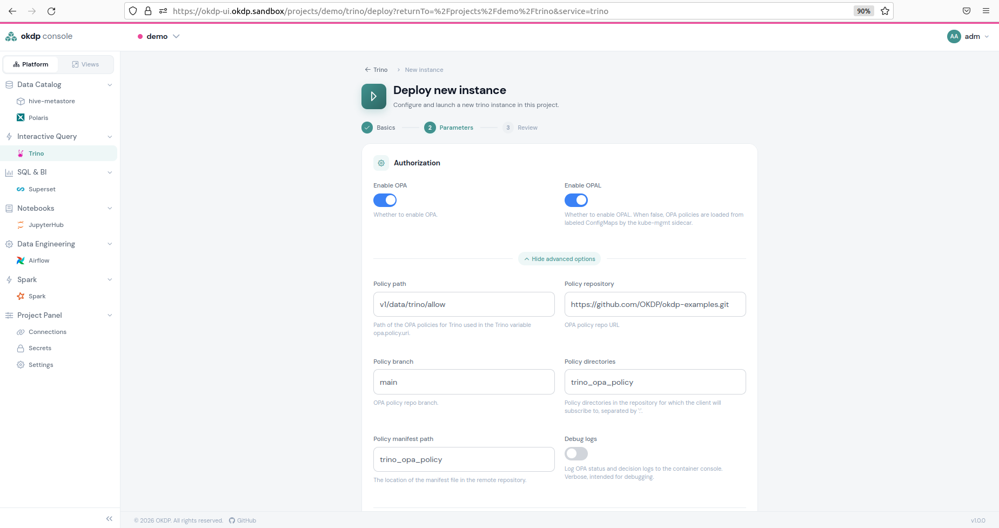

You may add Polaris catalogs to which Trino will have access to and choose the sizing meaning the number of workers and their maximum resource consumption.

When you then click on `Next` a recapitulation will be shown. If you agree, click on `Deploy instance`.

Here is a deployment example with only OPA and not OPAL:

```yaml
apiVersion: kubocd.kubotal.io/v1alpha1
kind: Release
metadata:
  name: demo-trino
  namespace: demo
  labels:
    okdp.io/project: demo
    okdp.io/service: trino
    okdp.io/instance-name: trino
spec:
  description: Trino of the demo project, bronze plus Iceberg catalogs
  package:
    repository: quay.io/okdp/platform-packages/trino
    tag: 480.0.0-p21
    interval: 30m
    timeout: 10m
  parameters:
    s3SecretRef: creds-trino-s3
    hiveCatalogs:
      - name: bronze
        metastore: kcd-demo-hive-metastore
        storage: demo-storage
    icebergCatalogs:
      - name: iceberg
        catalog: kcd-demo-polaris-catalog
        storage: demo-storage
        warehouse: demo
        oidcSecretRef: creds-polaris-root-okdp-sandbox
      - name: silver
        catalog: kcd-demo-polaris-catalog
        storage: demo-storage
        warehouse: silver
        oidcSecretRef: creds-polaris-root-okdp-sandbox
      - name: gold
        catalog: kcd-demo-polaris-catalog
        storage: demo-storage
        warehouse: gold
        oidcSecretRef: creds-polaris-root-okdp-sandbox
    enableOPA: true
  targetNamespace: demo
```

### Deploying Spark History Server

Spark History Server only needs access to the S3 storage provider. You, therefore, only need to give the S3 storage connection and the credentials to access them. In JSON format write the OIDC mapping for the access to the Spark History Server.

Here is an example in YAML format:

```yaml
apiVersion: kubocd.kubotal.io/v1alpha1
kind: Release
metadata:
  name: demo-spark-history
  namespace: demo
  labels:
    okdp.io/project: demo
    okdp.io/service: spark-history-server
    okdp.io/instance-name: spark-history
spec:
  description: Spark History Server of the demo project
  package:
    repository: quay.io/okdp/platform-packages/spark-history-server
    tag: 3.5.1-p07
    interval: 30m
    timeout: 10m
  parameters:
    storage: demo-storage
    s3SecretRef: creds-spark-history-s3
    roleMapping:
      admin_groups: [platform_admin]
      history_admin_groups: [platform_admin, auditor]
      modify_groups: [platform_admin, data_engineer]
      view_groups:
        [
          platform_admin,
          data_engineer,
          data_scientist,
          data_steward,
          business_analyst,
        ]
  targetNamespace: demo
```

### Deploying JupyterHub

The minimum specifications for JupyterHub are an S3 storage connection, an S3 storage credential secret, and an OIDC role mapping in order to avoid a 403 error for any user who tries to have access. Here is the minimal configuration in YAML format:

```yaml
apiVersion: kubocd.kubotal.io/v1alpha1
kind: Release
metadata:
  labels:
    okdp.io/instance-name: jupyterhub
    okdp.io/project: demo
    okdp.io/service: jupyterhub
  name: demo-jupyterhub
  namespace: demo
spec:
  description: jupyterhub for project demo
  package:
    interval: 30m0s
    repository: quay.io/okdp/platform-packages/jupyterhub
    tag: 4.3.3-p06
    timeout: 10m0s
  parameters:
    cpu: 0.5
    memoryGi: 1
    oidcRoleMapping:
      admin_groups: platform_admin
      allowed_groups: platform_admin
    s3SecretRef: creds-jupyterhub-s3
    storage: demo-storage
  targetNamespace: demo
```

However, access to S3 buckets is not limited; PySpark has no access to any Polaris catalog, and no Welcome notebook exists. These are all parameters to the exception of the last one that should be configured for more advanced usage of the JupyterHub deployment.

Here is an example of how to limit JupyterHub to certain buckets:

```yaml
spec:
  parameters:
    fileBrowserLocations:
      - { name: bronze, uri: s3://bronze }
      - { name: silver, uri: s3://silver }
      - { name: gold, uri: s3://gold }
```

Here is an example of how to give PySpark access to a Polaris catalog:

```yaml
spec:
  parameters:
    pyspark: [silver]
    connections:
      - name: silver
        properties: |
          spark.sql.extensions=org.apache.iceberg.spark.extensions.IcebergSparkSessionExtensions
          spark.sql.catalog.silver=org.apache.iceberg.spark.SparkCatalog
          spark.sql.catalog.silver.type=rest
          spark.sql.catalog.silver.warehouse=silver
          spark.sql.catalog.silver.uri=https://polaris-demo.{{ .Context.ingress.suffix }}/api/catalog
          spark.sql.catalog.silver.oauth2-server-uri=https://keycloak.{{ .Context.ingress.suffix }}/realms/master/protocol/openid-connect/token
          spark.sql.catalog.silver.scope=profile
          spark.sql.catalog.silver.rest.auth.type=oauth2
          spark.sql.catalog.silver.token-refresh-enabled=true
          spark.sql.catalog.silver.header.X-Iceberg-Access-Delegation=vended-credentials
          spark.sql.catalog.silver.io-impl=org.apache.iceberg.io.ResolvingFileIO
          spark.sql.catalog.silver.header.Polaris-Realm=sandbox
          spark.sql.catalog.silver.client.region=us-east-1
          spark.sql.catalog.silver.s3.region=us-east-1
```

A welcome notebook is written under the key `spec.parameters.welcomeNotebook` in JSON format.

### Deploying Superset

Superset needs two database-server connections. One to the database containing the data and the other one to the metadata. Without an OIDC mapping, every user lands in the Public category, and Superset refuses all.

Here is an example of a Superset deployment in YAML format:

```yaml
apiVersion: kubocd.kubotal.io/v1alpha1
kind: Release
metadata:
  name: demo-superset
  namespace: demo
  labels:
    okdp.io/project: demo
    okdp.io/service: superset
    okdp.io/instance-name: superset
spec:
  description: Superset of the demo project
  package:
    repository: quay.io/okdp/platform-packages/superset
    tag: 6.0.0-p04
    interval: 30m
    timeout: 10m
  parameters:
    metadataDb: demo-db-superset
    examplesDb: demo-db-superset-examples
    oidcRoleMapping:
      platform_admin: [Admin]
      data_engineer: [Alpha, sql_lab]
      data_scientist: [Alpha, sql_lab]
      business_analyst: [Gamma]
      data_steward: [Gamma, sql_lab]
      auditor: [Gamma]
    datasources:
      - { name: trino-bronze, trino: kcd-demo-trino-endpoint, catalog: bronze }
      - { name: trino-silver, trino: kcd-demo-trino-endpoint, catalog: silver }
      - { name: trino-gold, trino: kcd-demo-trino-endpoint, catalog: gold }
  targetNamespace: demo
```

## Monitoring

An important task is to monitor the functioning of the instances as well as to check the resource consumption.

### Resource consumption

Metrics-server must be installed in order to have the resource consumption displayed in the user interface.

CPU and memory are displayed in the OKDP control plane for each project and each instance. Concerning the latter, a colored bar shows the consumption relative to the maximum capacity.

### Operationability and debugging

The status of the instances, pods, connections, secret stores, and external secrets already reveals if there is a potential problem. If it is the case, look at the details of these objects by clicking on them or on the little eye icon when it concerns an instance. The details section of an instance at the top displays error and warning messages for your information. For deeper investigation, look at the pod's logs.

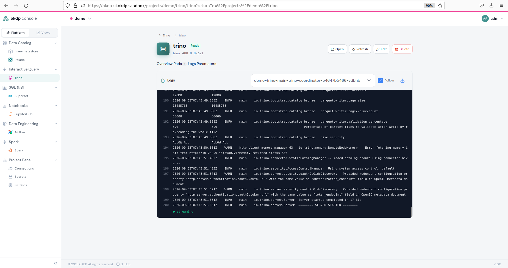

Logs can also be downloaded by clicking on the download icon on the top right above the log display.

However, these debugging tools in the user interface are not always sufficient, and you may have to switch to manual debugging in a terminal with command line instructions.
