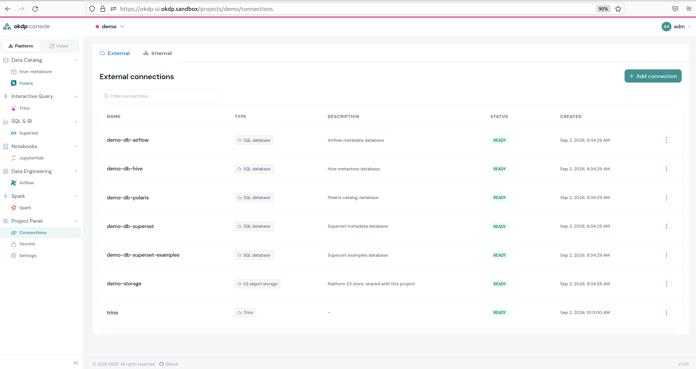
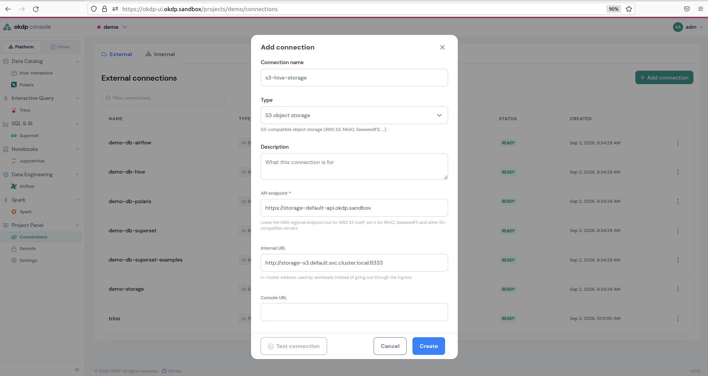
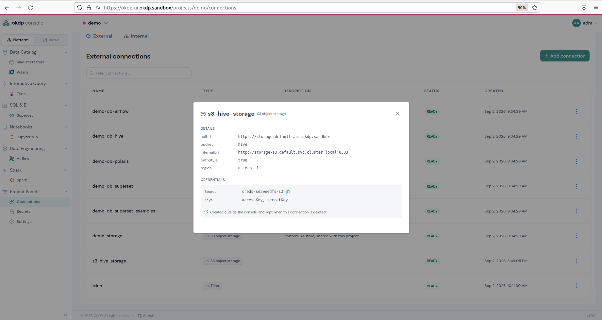
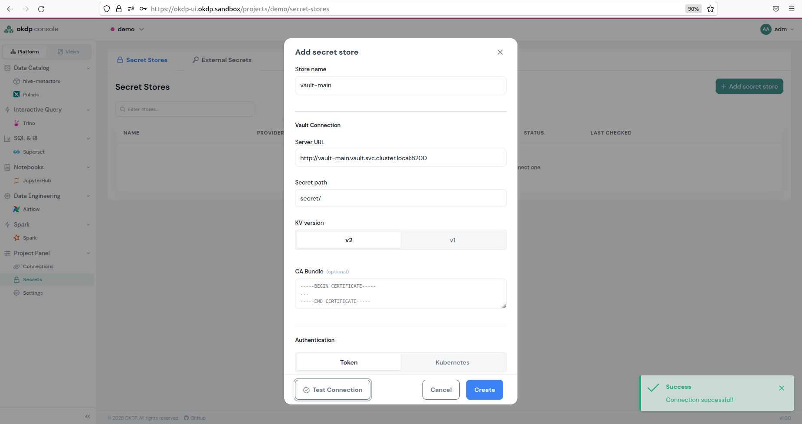
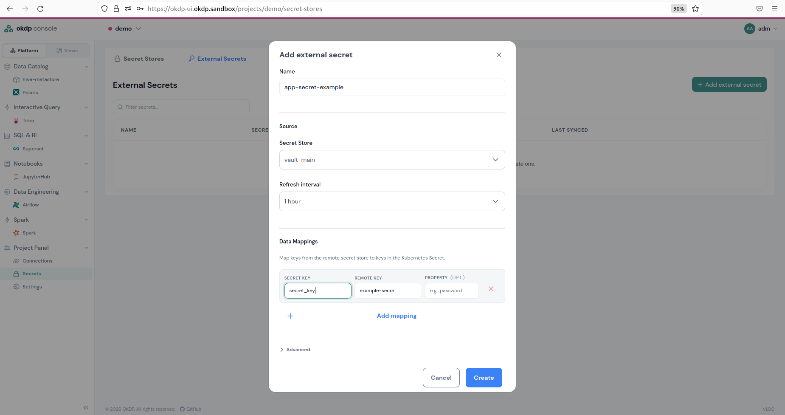
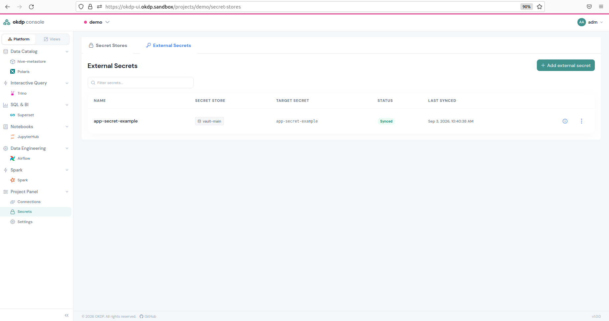

## Connexions

Une connexion relie un service à un autre service ou à un fournisseur de stockage ou de base de données. Elle suit un contrat, qui fixe ses champs :

| Contrat           | Usage                                | Champs principaux                                                      | Champs secrets           |
| ----------------- | ------------------------------------ | ---------------------------------------------------------------------- | ------------------------ |
| `s3`              | Stockage objet S3                    | `apiUrl`, `internalUrl`, `consoleUrl`, `bucket`, `region`, `pathStyle` | `accessKey`, `secretKey` |
| `database-server` | Base de données SQL                  | `engine`, `driver`, `host`, `port`, `dbName`, `sslMode`, `tls`         | `username`, `password`   |
| `hive`            | Connexion thrift à un Hive Metastore | `thriftUri`                                                            |                          |
| `iceberg-catalog` | Catalogue REST Iceberg (Polaris)     | `uri`, `internalUri`, `realm`                                          |                          |
| `trino`           | Trino                                | `url`, `uri`, `internalUri`, `catalogs`                                |                          |

Les champs non secrets sont écrits dans le dépôt Git de déploiement. Les champs secrets ne le sont jamais : ils restent dans un secret Kubernetes du namespace du projet, désigné par `secretRef`, que les services lisent à l'exécution.

Il existe deux sortes de connexions.

### Connexions externes

Une connexion externe est un fichier du projet dans le dépôt de déploiement, `projects/<project>/connections/<name>.yaml`. Voici un exemple de connexion au stockage S3 de la plateforme :

```yaml
connections:
  demo-storage:
    contract: s3
    apiUrl: https://storage-default-api.okdp.sandbox
    internalUrl: http://default-storage-s3.default.svc.cluster.local:8333
    region: us-east-1
    pathStyle: true
    secretRef:
      name: creds-seaweedfs-s3
```

Et une connexion à une base de données PostgreSQL :

```yaml
connections:
  demo-db-hive:
    contract: database-server
    engine: postgresql
    driver: org.postgresql.Driver
    host: demo-pg-rw.demo.svc.cluster.local
    port: 5432
    dbName: hive
    sslMode: disable
    secretRef:
      name: creds-hive-metastore-db
```

Le nom de la connexion est le nom du fichier. Une instance l'utilise lorsqu'elle la liste sous `connections` dans son `instance.yaml` et la nomme dans un paramètre (par exemple `storage: demo-storage`) : le fichier devient alors l'une des couches de valeurs de la release. Les connexions `s3` et `database-server` sont toujours des connexions externes, car leurs fournisseurs se trouvent dans d'autres namespaces ou servent plusieurs bases de données.

### Connexions vers d'autres instances

Les instances Hive Metastore, Polaris et Trino fournissent elles-mêmes une connexion (contrats `hive`, `iceberg-catalog` et `trino`). Une autre instance du même projet l'utilise en nommant la release du fournisseur, `<project>-<instance>`, dans un paramètre, sans aucun fichier de connexion : Trino accède à l'instance Hive Metastore `hive` du projet `demo` avec `metastore: demo-hive`. L'adresse suit une convention fixe, par exemple `thrift://demo-hive-hive-metastore.demo.svc:9083`.

Ces connexions sont listées dans le descripteur d'instance. Chaque charte de service OKDP produit un ConfigMap `<release>-okdp` dans le namespace du projet, que la console lit pour découvrir les instances, leur URL, leurs notes d'utilisation et les connexions qu'elles fournissent :

```yaml
apiVersion: v1
kind: ConfigMap
metadata:
  name: demo-hive-okdp
  namespace: demo
  labels:
    okdp.io/instance: demo-hive
    okdp.io/service: hive-metastore
    okdp.io/provides-hive: "true"
    app.kubernetes.io/instance: demo-hive
data:
  service: hive-metastore
  version: 4.0.1-1.0.1
  url: ""
  usage: |
    ...
  outputs.yaml: |
    - name: demo-hive
      contract: hive
      values:
        thriftUri: thrift://demo-hive-hive-metastore.demo.svc:9083
```

Le descripteur fonctionne de la même façon avec Flux et Argo CD. Une référence à une autre instance n'est pas vérifiée lors du rendu de la charte : un nom de release erroné n'apparaît qu'à l'exécution. La console ne propose que des instances existantes.

Dans l'interface utilisateur, la section dédiée aux connexions se trouve sous `Project Panel` -> `Connections` et vous redirige vers la page suivante :



### Types de connexions

Vous pouvez choisir parmi plusieurs types de connexions. Deux d'entre eux concernent les composants externes mentionnés dans les [Prérequis d'installation](/fr/installation-requirements)

- `S3 object storage`
- `SQL Database`

Et les trois services OKDP :

- `Hive metastore` pour la connexion thrift à Hive Metastore
- `Iceberg Rest Catalog` étant une connexion à Polaris
- `Trino`

Le choix entre ces différents types détermine les autres paramètres à saisir pour établir une connexion. Les trois derniers ne sont utiles que pour un service extérieur au projet ; au sein du projet, la console propose directement les instances.

### Création de connexions

Pour créer une connexion via l'interface utilisateur, cliquez sur `+ Add connection`, donnez-lui un nom et choisissez un type. Le nom est un libellé DNS (lettres minuscules, chiffres et `-`). Remplissez ensuite les champs obligatoires, puis cliquez sur `Create`.



La console fait le commit du fichier de connexion dans Git. Les identifiants saisis sont placés dans un secret `<name>-credentials` du namespace du projet, créé par la console ; vous pouvez aussi désigner un secret existant.

En cliquant sur la connexion, vous accédez à ses détails. Les trois points situés à droite de la ligne de connexion vous permettent de modifier ou de supprimer la connexion. Une connexion encore utilisée par une instance ne peut pas être supprimée : la console indique les instances concernées.

Remarque : les fichiers de connexion ajoutés directement dans Git s’affichent également dans l’interface utilisateur et peuvent être gérés à partir de celle-ci.



## Ajouter un magasin de secret et ajouter des secrets externes

Le plan de contrôle OKDP vous permet d’accéder aux secrets stockés dans un magasin de secret et de générer un secret Kubernetes. Le composant sous-jacent est l’External Secrets Operator, qui doit être installé. Pour mener à bien cette tâche, il faut d’abord établir une connexion à un magasin de secret. Vous pouvez ensuite synchroniser et accéder au secret souhaité dans le magasin de secret afin de l’utiliser pour les services OKDP. Contrairement aux connexions, les magasins de secret et les secrets externes ne sont pas écrits dans Git : la console crée les objets `SecretStore` et `ExternalSecret` directement dans le namespace du projet.

### Ajouter un magasin de secret

Le plan de contrôle OKDP a été testé avec Vault comme magasin de secret, et c'est celui-ci qui est pris comme exemple dans le cas présent.

Cette opération crée un objet `secretStore` à partir du contrôleur External Secrets.

Pour créer un magasin de secret dans le plan de contrôle OKDP, rendez-vous dans `Project Panel` -> `Secrets` -> `Secret Stores`, puis cliquez sur `+ Add secret store`.

Remplissez les champs obligatoires :

- `Store-name`, un nom que vous attribuez à la connexion à un magasin de secret.
- `Server URL`, l’URL du magasin de secret.
- `Secret path`, le chemin d’accès au sein du magasin de secret où sont stockés les secrets qui vous intéressent.
- `Authentication`, choisissez entre `Token`, où vous collez le jeton d’authentification du magasin de secret, ou `Kubernetes`, où vous utilisez un secret Kubernetes.
- `CA bundle`, si nécessaire, collez le contenu du fichier Certificats d'Autorité encodé.

Ensuite, cliquez sur `Test connection` pour vérifier la communication entre le plan de contrôle OKDP et le magasin de secret. Si la connexion fonctionne, cliquez sur `Create`.



Voici les détails du magasin de secret au format YAML qui vient d’être créé, affichés à l’aide de la commande `kubectl get secretStore -n demo vault-main -o yaml` :

```yaml
apiVersion: external-secrets.io/v1
kind: SecretStore
metadata:
  creationTimestamp: "2026-09-03T08:10:37Z"
  generation: 1
  name: vault-main
  namespace: demo
  resourceVersion: "185959"
  uid: c9868bd6-6d9b-4465-abd8-6698de6906cb
spec:
  provider:
    vault:
      auth:
        tokenSecretRef:
          key: token
          name: vault-main-credentials
      path: secret/
      server: http://vault-vault.vault.svc.cluster.local:8200
      version: v2
status:
  capabilities: ReadWrite
  conditions:
    - lastTransitionTime: "2026-09-03T08:10:37Z"
      message: store validated
      reason: Valid
      status: "True"
      type: Ready
```

### Ajouter un secret externe

Pour créer un secret Kubernetes à partir d’un magasin de secret via le plan de contrôle OKDP, accédez à la section `External Secrets`, qui correspond à l’onglet situé à côté de l’onglet `Secret Store`, puis cliquez sur `Add external secret`.

Remplissez les champs suivants :

- `Name` : nom du secret externe.
- `Secret Store` : il s’agit d’une connexion au magasin de secret qui a été créée comme indiqué précédemment.
- `Refresh interval` : délai écoulé avant la synchronisation avec le magasin de secret.
- Dans la section `Data Mappings` :
  - `SECRET KEY` : clé permettant d’accéder à la valeur du secret.
  - `REMOTE KEY` : nom du secret externe dans le magasin de secret.
  - `PROPERTY` : champ facultatif permettant d’ajouter des informations sur le secret.
- Le `Kubernetes secret name` est par défaut identique au nom du secret externe, mais peut être modifié.

Cliquez ensuite sur `Create`.



L’objet `externalSecret` a été créé comme suit :

```yaml
apiVersion: external-secrets.io/v1
kind: ExternalSecret
metadata:
  creationTimestamp: "2026-09-03T13:49:51Z"
  generation: 2
  name: app-secret-example
  namespace: demo
  resourceVersion: "281555"
  uid: 972b7dd9-1fa5-412d-a312-7da6c76e925f
spec:
  data:
    - remoteRef:
        conversionStrategy: Default
        decodingStrategy: None
        key: example-secret
        metadataPolicy: None
      secretKey: secret_key
  refreshInterval: 1h
  secretStoreRef:
    kind: SecretStore
    name: vault-main
  target:
    creationPolicy: Owner
    deletionPolicy: Retain
    name: app-secret-example
status:
  binding:
    name: app-secret-example
  conditions:
    - lastTransitionTime: "2026-09-03T13:53:45Z"
      message: secret synced
      reason: SecretSynced
      status: "True"
      type: Ready
  refreshTime: "2026-09-03T13:53:45Z"
  syncedResourceVersion: 2-2f2c636d06132f67992c15a1daeb0a5f
```

La synchronisation s'effectue, et une fois terminée, le statut devrait indiquer `Synced`.



À présent, dans votre terminal, vous devriez voir apparaître un secret dans l'espace de noms portant le même nom que le secret Kubernetes :

```sh
kubectl get secret -n demo app-secret-example
NAME                 TYPE     DATA   AGE
app-secret-example   Opaque   1      52s
```

Une fois que vous avez supprimé le secret externe dans le plan de contrôle OKDP, l'objet Kubernetes disparaît également.
