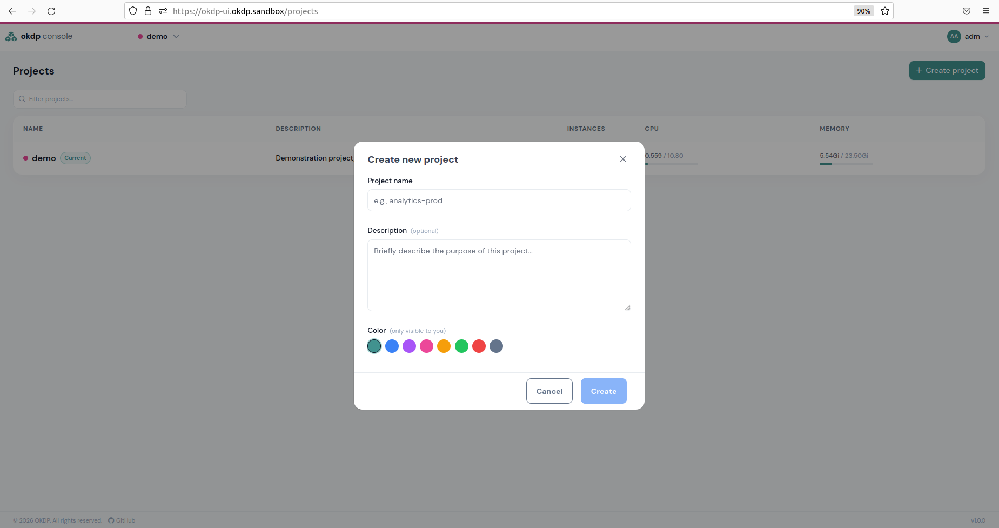
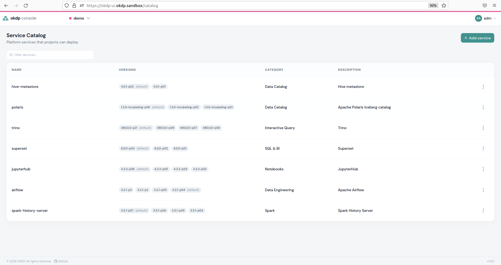
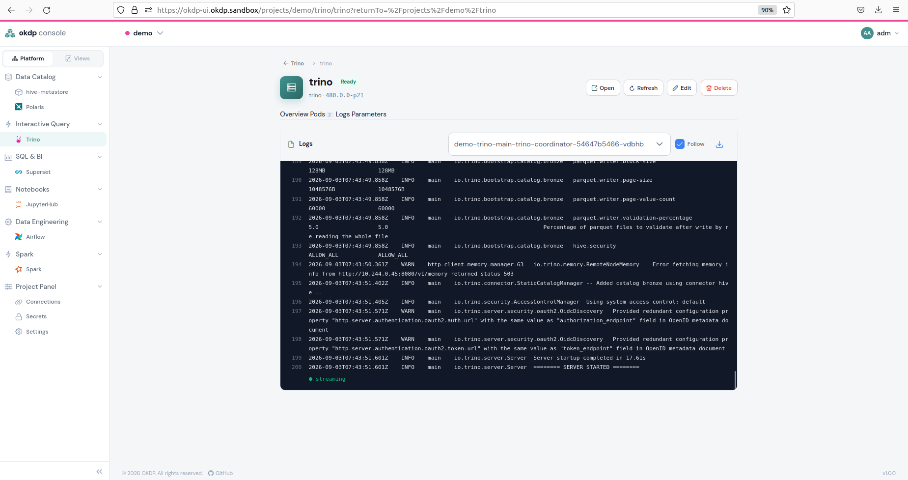

## Projets

Les projets sont des [namespace](https://kubernetes.io/docs/concepts/overview/working-with-objects/namespaces/) Kubernetes comportant le libellé `okdp.io/project`, qui isolent les services d’application déployés au sein de ces espaces de noms de ceux des autres projets. Il n’est pas possible de lier deux services situés dans des espaces de noms différents. Trino, par exemple, ne peut pas communiquer avec un Hive Metastore provenant d’un autre projet.

Le nom du projet correspond au nom du namespace. Dans le dépôt Git de déploiement, un projet est le répertoire `projects/<project>/`, décrit par son fichier `project.yaml`, et qui contient les connexions et les instances de service du projet.

Voici un exemple de projet, `projects/demo/project.yaml` :

```yaml
name: demo
description: Demonstration project, full data chain
```

Le moteur GitOps crée le namespace lorsqu'il déploie la première instance du projet. La console le crée également, avec le libellé `okdp.io/project` :

```yaml
apiVersion: v1
kind: Namespace
metadata:
  name: demo
  labels:
    okdp.io/project: demo
```

Pour créer un nouveau projet via l'interface utilisateur, cliquez sur le bouton en haut à gauche indiquant votre projet actuel, puis sur `all projects`. Tous vos projets y sont répertoriés, et vous pouvez en créer un nouveau en cliquant sur `+ Create project`. Une fenêtre s'ouvre et vous demande de saisir le nom du projet, éventuellement une description, et de choisir une couleur de police (que vous pourrez modifier ultérieurement) ; cliquez ensuite sur `CREATE` pour initialiser le projet.



Passez d’un projet à l’autre en cliquant sur l’onglet en haut à gauche indiquant le nom de votre projet actuel et en choisissant parmi tous les projets créés.

Pour supprimer définitivement un projet, rendez-vous dans `Project Panel` -> `Settings` et, dans la section `Delete this project`, cliquez sur `Delete`. La suppression définitive est effectuée après confirmation de votre part.

La suppression d’un projet retire le répertoire `projects/<project>/` de Git, si bien que le moteur GitOps désinstalle toutes les instances du projet, puis la console supprime le namespace.

Remarque : la suppression d’un projet entraîne la suppression de l’espace de noms. Toutes les instances et tous les objets contenus dans cet espace de noms seront supprimés et ne pourront pas être récupérés.

## Personnalisation du catalogue de services

Le plan de contrôle OKDP vous permet d’ajouter, de supprimer et de modifier des services dans le catalogue de services. Le catalogue est le fichier `platform/catalog.yaml` du dépôt de déploiement : chaque modification faite dans la console est un commit de ce fichier, que vous pouvez aussi modifier dans Git. Pour cela, cliquez en haut à droite sur votre nom d’utilisateur, puis sur `Administration` -> `Service Catalog`. Vous serez alors redirigé vers la page suivante, qui répertorie tous les services actuellement présents dans votre catalogue :



Sur chaque ligne de service, les trois points situés à droite vous permettent de modifier ou de supprimer un service. Pour ajouter un service, cliquez sur le bouton `+ Add service` en haut à droite. Vous devez ensuite indiquer un nom de service, une version pour ce service et le dépôt OCI de sa charte Helm (par défaut le `defaultRepository` du catalogue, `oci://quay.io/okdp/platform-charts`). Les versions sont celles des chartes publiées dans ce dépôt. Les autres champs sont facultatifs. En cliquant sur `Add service`, celui-ci apparaît alors dans la liste.

## Monitoring

Une tâche importante consiste à surveiller le fonctionnement des instances ainsi qu’à vérifier leur consommation de ressources.

### Consommation des ressources

Le [Kubernetes Metrics Server](https://github.com/kubernetes-sigs/metrics-server) doit être installé pour que la consommation des ressources s'affiche dans l'interface utilisateur.

L'utilisation du processeur et de la mémoire s'affiche dans le plan de contrôle OKDP pour chaque projet et chaque instance. Pour chaque instance, une barre colorée indique la consommation par rapport à la capacité maximale.

### Opérabilité et débogage

L'état des instances, des pods, des connexions, des outils de stockage de secrets et des secrets externes permet de détecter un éventuel problème. Une instance est `Pending` tant que son commit attend le moteur GitOps, `Installing` ou `Updating` pendant que le moteur la déploie, `Ready` lorsque ses workloads sont opérationnels, et `Error` lorsque le moteur signale un échec (par exemple une charte dont le rendu échoue avec les valeurs fournies) : le message du moteur est affiché dans les détails de l'instance. Si tel est le cas, consultez les détails de ces objets en cliquant dessus ou sur la petite icône en forme d'œil lorsqu'il s'agit d'une instance. La section `Details` d'une instance, en haut de la page, affiche les messages d'erreur et d'avertissement à titre d'information. Pour une analyse plus approfondie, consultez les journaux du pod.



Les journaux peuvent également être téléchargés en cliquant sur l’icône de téléchargement située en haut à droite, au-dessus de l’affichage des journaux.

Cependant, ces outils de débogage disponibles dans l’interface utilisateur ne sont pas toujours suffisants, et vous devrez peut-être passer à un débogage manuel dans un terminal à l’aide de commandes en ligne. Les objets du moteur portent le nom de la release `<project>-<instance>` :

```sh
# Flux : HelmRelease dans le namespace okdp-releases
kubectl get helmrelease -n okdp-releases demo-hive
# Argo CD : Application dans le namespace argocd
kubectl get application -n argocd demo-hive
# Les deux : le descripteur de l'instance et ses workloads
kubectl get configmap -n demo demo-hive-okdp
kubectl get pods -n demo -l app.kubernetes.io/instance=demo-hive
```
