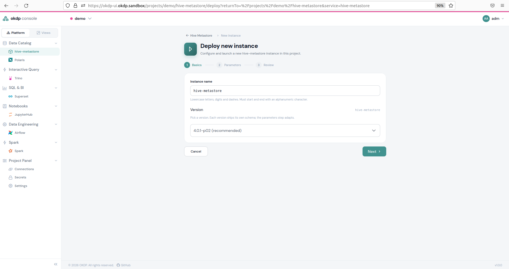
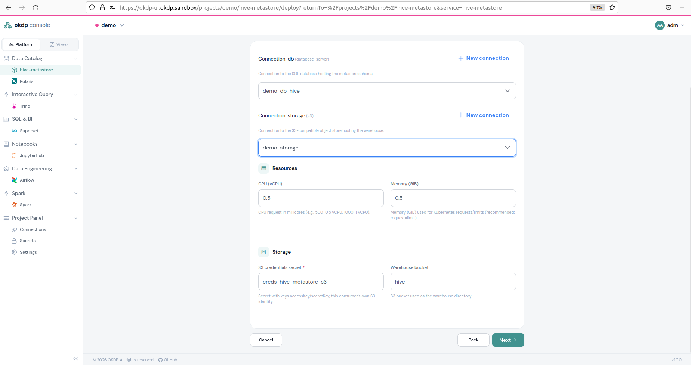
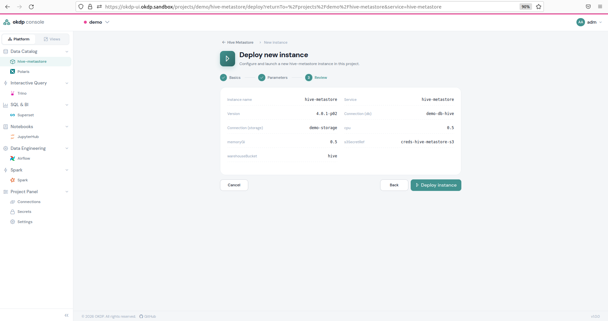
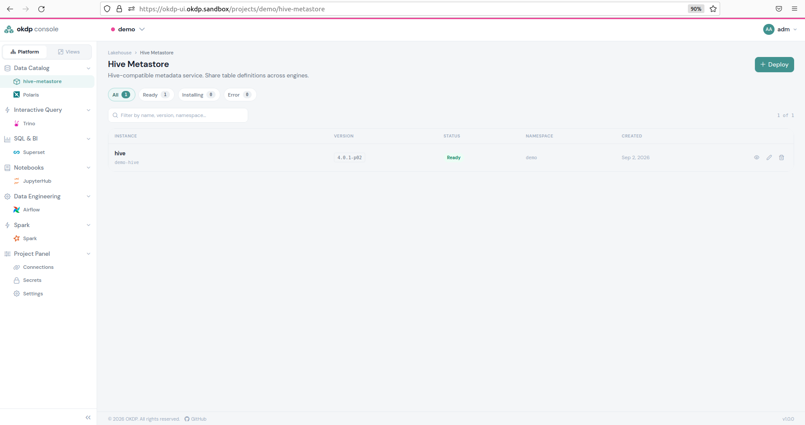
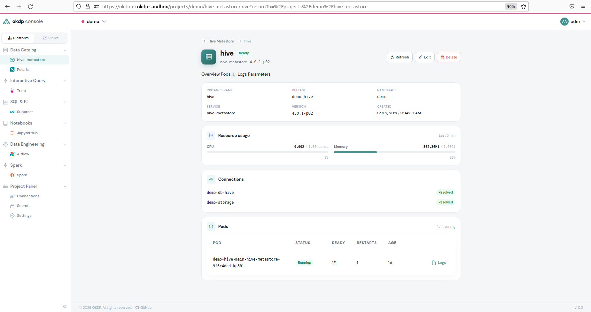
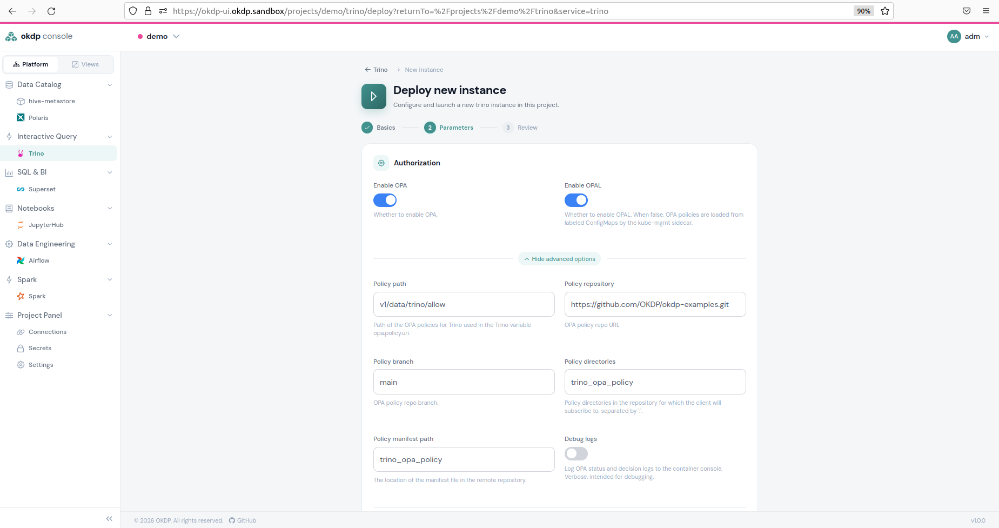

Le plan de contrôle OKDP permet à l’administrateur de déployer, de supprimer et de surveiller des services, ce qui constitue son objectif principal.

Dans OKDP, un service est une charte Helm accompagnée d'un fichier de valeurs dans le [dépôt Git de déploiement](/fr/installation-requirements/deployments-repository). Une instance d'un service est un répertoire `projects/<project>/services/<instance>/` contenant un fichier `instance.yaml` (la charte et sa version) et un fichier `values.yaml` (les paramètres). Flux ou Argo CD la déploie sous la forme de la release Helm `<project>-<instance>` dans le namespace du projet. La console écrit exactement ces fichiers : vous pouvez donc déployer depuis la console ou faire vous-même le commit des fichiers, le résultat est le même.

Le déploiement d’un service dans l’interface utilisateur suit toujours le même schéma. Sur la page d’instance du service, cliquez sur `Deploy`, puis suivez les 3 étapes suivantes :

1. Choisissez le nom de l’instance et la version de la charte pour celle-ci.
2. Configurez les paramètres de l’instance.
3. Validez le récapitulatif de la configuration.
4. Vous revenez à la page d’instance du service, où vous pouvez vérifier l’état de l’instance.
5. En cliquant sur la petite icône en forme d’œil à droite de la ligne correspondant à votre instance, vous êtes alors redirigé vers une page présentant tous les détails de l’instance, ainsi que ses pods déployés et leur état ; vous pouvez les consulter en cliquant sur le bouton `Logs`.

Lors d'un déploiement, la console fait le commit des fichiers dans Git et l'instance affiche l'état `Pending` jusqu'à ce que le moteur GitOps ait pris en compte le commit. Elle passe ensuite par `Installing` puis `Ready`, ou `Error` avec le message du moteur. Seuls les paramètres que vous avez renseignés sont écrits dans `values.yaml` ; les valeurs par défaut de la charte s'appliquent aux autres.

Un exemple complet est fourni avec le premier service mentionné, Hive Metastore. Pour les autres services, à l’exception de Trino, la configuration de déploiement est fournie sous la forme des deux fichiers de l'instance, dont vous pouvez faire le commit dans le dépôt de déploiement.

Chaque instance d’un service peut être modifiée en cliquant sur le petit crayon situé à droite de la ligne de l’instance sur la page dédiée, ou supprimée définitivement en cliquant sur la corbeille. Modifier les paramètres réécrit `values.yaml` ; choisir une autre version dans la page de modification réécrit `instance.yaml`, et le moteur met à jour la release sur place. Supprimer une instance retire son répertoire de Git, et le moteur désinstalle la release.

### Ordre et dépendances des services

Les services d'un projet n'ont pas d'ordre de déploiement : chaque charte attend ce dont elle a besoin et converge dans n'importe quel ordre. Toutefois, presque tous les services ont besoin d'une connexion à un fournisseur de stockage et/ou à un serveur de base de données, qui doit exister avant leur déploiement : voir [Gestion des connexions et des secrets externes](/fr/admin-guide/connections-and-external-secrets-management). Un service qui fait référence à une autre instance du projet (Trino vers un Hive Metastore, Superset vers Trino) la désigne par son nom de release `<project>-<instance>`.

### Déploiement de Hive Metastore

Hive Metastore nécessite une connexion à un fournisseur de stockage S3 et à un serveur de base de données. Si aucun de ces éléments n'est présent, le déploiement ne sera pas possible.

Dans le cas contraire, le déploiement d'une instance Hive Metastore est très simple. Dans le `Data Catalog`, cliquez sur `hive-metastore`, puis sur `+ Deploy`. Choisissez un nom d’instance et une version de la charte Hive Metastore, puis cliquez sur `Next`.



Sélectionnez ensuite une connexion au serveur de base de données et une connexion au fournisseur de stockage S3. S’ils n’existent pas, vous pouvez les créer en cliquant sur `+ New connection` et en suivant les étapes décrites dans [Gestion des connexions et des secrets externes](/fr/admin-guide/connections-and-external-secrets-management#création-de-connexions). Saisissez les quantités de ressources et choisissez un secret Kubernetes pour l’authentification du stockage S3, ainsi que, de manière facultative, un compartiment (bucket) qui limite le Hive Metastore. Une fois cela fait, cliquez sur `CREATE`.



Vérifiez maintenant que la configuration correspond à vos attentes, puis cliquez sur `Deploy instance`.



Attendez que le `Status` passe à `Ready`.



En cliquant sur la petite icône en forme d’œil à droite, vous accédez aux détails de l’instance qui affichent les pods déployés ainsi que leur statut, et vous pouvez consulter leurs journaux.



En cliquant sur la petite icône en forme de crayon ou sur l’icône de la poubelle, vous pouvez modifier ou supprimer l’instance.

Voici le même déploiement que celui présenté dans les captures d’écran, sous forme de fichiers du dépôt de déploiement. `projects/demo/services/hive/instance.yaml` :

```yaml
name: hive
project: demo
service: hive-metastore
chart: oci://quay.io/okdp/platform-charts/hive-metastore
version: 4.0.1-1.0.1
connections:
  - demo-db-hive
  - demo-storage
```

`projects/demo/services/hive/values.yaml` :

```yaml
db: demo-db-hive
storage: demo-storage
s3SecretRef: creds-hive-metastore-s3
warehouseBucket: hive
```

La release est `demo-hive`. Elle fournit une connexion `hive` nommée `demo-hive`, utilisée par Trino ci-dessous.

### Déploiement de Polaris

Polaris nécessite une connexion et les identifiants d'accès au stockage S3, ainsi qu'une connexion à une base de données PostgreSQL. Il sert un domaine (realm), dans lequel il peut créer des entités « principal » Polaris.

Notez que l'entité « principal » de Polaris est utilisée via l'API de gestion. Polaris n'authentifie pas les clients Keycloak ; il gère ses propres entités « principal ». Les identifiants root du domaine sont générés une seule fois dans le secret `<release>-root` (ici `demo-polaris-root`) et conservés lorsque l'instance est supprimée, car le domaine subsiste dans la base de données.

`projects/demo/services/polaris/instance.yaml` :

```yaml
name: polaris
project: demo
service: polaris
chart: oci://quay.io/okdp/platform-charts/polaris
version: 1.3.0-incubating-2.0.0
connections:
  - demo-db-polaris
  - demo-storage
```

`projects/demo/services/polaris/values.yaml` :

```yaml
db: demo-db-polaris
storage: demo-storage
s3SecretRef: creds-polaris-s3
realm: sandbox
principals:
  - name: service-account-svc-polaris-api-admin
    roles: [service_admin, catalog_admin]
```

La release `demo-polaris` fournit une connexion `iceberg-catalog` nommée `demo-polaris`.

### Déploiement de Trino

Avant de déployer Trino, assurez-vous qu’une instance de Hive Metastore et/ou une instance de Polaris est déployée.

Vous avez la possibilité d’ajouter [OPA (Open Policy Agent)](https://www.openpolicyagent.org) en tant que composant RBAC pour Trino. Cochez la case OPA pour créer un pod contenant un conteneur de serveur OPA et un conteneur de gestion Kube permettant de lire les configmaps au sein du namespace du projet. Si, en outre, vous choisissez [OPAL (Open Policy Administration Layer)](https://docs.opal.ac), le pod OPA ne contient qu’un serveur OPA et aucun conteneur Kubemanagement. Les politiques sont alors synchronisées via OPAL, composé des pods suivants :

- Serveur OPAL
- Client OPAL
- Base de données Postgres

La synchronisation des politiques s'effectue dans ce cas à partir du dépôt Git saisi dans le champ obligatoire. Si seule la case OPAL est cochée, ni OPA ni OPAL ne sont déployés.



Vous pouvez ajouter des catalogues Polaris et choisir le dimensionnement, c'est-à-dire le nombre de workers et leur consommation maximale de ressources.

Lorsque vous cliquez ensuite sur `Next`, tous les paramètres sont récapitulés. Si vous êtes d'accord, cliquez sur `Deploy instance`.

Voici un exemple de déploiement avec uniquement OPA et sans OPAL. Les catalogues font référence aux instances Hive Metastore et Polaris du projet par leur nom de release ; un catalogue sur une instance Polaris du projet doit indiquer son `warehouse`. `projects/demo/services/trino/instance.yaml` :

```yaml
name: trino
project: demo
service: trino
chart: oci://quay.io/okdp/platform-charts/trino
version: 480.0.0-1.0.1
connections:
  - demo-storage
```

`projects/demo/services/trino/values.yaml` :

```yaml
s3SecretRef: creds-trino-s3
hiveCatalogs:
  - name: bronze
    metastore: demo-hive
    storage: demo-storage
icebergCatalogs:
  - name: silver
    catalog: demo-polaris
    storage: demo-storage
    warehouse: silver
    oidcSecretRef: demo-polaris-root
  - name: gold
    catalog: demo-polaris
    storage: demo-storage
    warehouse: gold
    oidcSecretRef: demo-polaris-root
enableOPA: true
```

### Déploiement de Spark History Server

Spark History Server a uniquement besoin d'accéder au fournisseur de stockage S3. Il vous suffit donc de fournir les informations de connexion S3. Rédigez au format JSON le mappage OIDC permettant l'accès à Spark History Server.

Voici un exemple, `projects/demo/services/spark-history/instance.yaml` :

```yaml
name: spark-history
project: demo
service: spark-history-server
chart: oci://quay.io/okdp/platform-charts/spark-history-server
version: 3.5.1-1.0.1
connections:
  - demo-storage
```

`projects/demo/services/spark-history/values.yaml` :

```yaml
storage: demo-storage
s3SecretRef: creds-spark-history-s3
roleMapping:
  admin_groups: [platform_admin]
  history_admin_groups: [platform_admin, auditor]
  modify_groups: [platform_admin, data_engineer]
  view_groups:
    [
      platform_admin,
      data_engineer,
      data_scientist,
      data_steward,
      business_analyst,
    ]
```

### Déploiement de JupyterHub

La configuration minimale requise pour JupyterHub comprend une connexion au stockage S3, un secret d'authentification pour le stockage S3 et un mappage de rôles OIDC afin d'éviter une erreur 403 pour tout utilisateur tentant d'y accéder. Voici la configuration minimale, `projects/demo/services/jupyterhub/instance.yaml` :

```yaml
name: jupyterhub
project: demo
service: jupyterhub
chart: oci://quay.io/okdp/platform-charts/jupyterhub
version: 4.3.3-1.0.1
connections:
  - demo-storage
```

`projects/demo/services/jupyterhub/values.yaml` :

```yaml
cpu: 0.5
memoryGi: 1
oidcRoleMapping:
  admin_groups: [platform_admin]
  allowed_groups: [platform_admin]
s3SecretRef: creds-jupyterhub-s3
storage: demo-storage
```

Avec cette configuration minimale, l'accès aux compartiments S3 est illimité, PySpark ne peut accéder à aucun catalogue Polaris et aucun notebook de bienvenue n'est inclus. À l'exception du notebook de bienvenue, ces paramètres peuvent tous être modifiés pour des déploiements JupyterHub plus avancés.

Voici un exemple montrant comment limiter l'accès de JupyterHub à certains compartiments (buckets) :

```yaml
fileBrowserLocations:
  - { name: bronze, uri: s3://bronze }
  - { name: silver, uri: s3://silver }
  - { name: gold, uri: s3://gold }
```

Voici un exemple illustrant comment autoriser PySpark à accéder à un catalogue Polaris, avec le paramètre `sparkConnections`. Le marqueur `{{ .Values.global.okdp.ingress.suffix }}` est remplacé par le suffixe d'ingress de la plateforme ; toute autre valeur est écrite telle quelle.

```yaml
pyspark: [silver]
sparkConnections:
  - name: silver
    properties: |
      spark.sql.extensions=org.apache.iceberg.spark.extensions.IcebergSparkSessionExtensions
      spark.sql.catalog.silver=org.apache.iceberg.spark.SparkCatalog
      spark.sql.catalog.silver.type=rest
      spark.sql.catalog.silver.warehouse=silver
      spark.sql.catalog.silver.uri=https://polaris-demo.{{ .Values.global.okdp.ingress.suffix }}/api/catalog
      spark.sql.catalog.silver.oauth2-server-uri=https://keycloak.{{ .Values.global.okdp.ingress.suffix }}/realms/master/protocol/openid-connect/token
      spark.sql.catalog.silver.scope=profile
      spark.sql.catalog.silver.rest.auth.type=oauth2
      spark.sql.catalog.silver.token-refresh-enabled=true
      spark.sql.catalog.silver.header.X-Iceberg-Access-Delegation=vended-credentials
      spark.sql.catalog.silver.io-impl=org.apache.iceberg.io.ResolvingFileIO
      spark.sql.catalog.silver.header.Polaris-Realm=sandbox
      spark.sql.catalog.silver.client.region=us-east-1
      spark.sql.catalog.silver.s3.region=us-east-1
```

Un notebook de bienvenue est défini sous le paramètre `welcomeNotebook` au format JSON.

### Déploiement de Superset

Superset nécessite deux connexions au serveur de base de données : l’une vers la base de données contenant les données, et l’autre vers celle contenant les métadonnées. En l’absence de mappage OIDC, tous les utilisateurs sont classés dans la catégorie « Public », et Superset les rejette tous. Ses sources de données peuvent désigner l'instance Trino du projet par son nom de release.

Voici un exemple de déploiement de Superset, `projects/demo/services/superset/instance.yaml` :

```yaml
name: superset
project: demo
service: superset
chart: oci://quay.io/okdp/platform-charts/superset
version: 6.0.0-1.1.0
connections:
  - demo-db-superset
  - demo-db-superset-examples
```

`projects/demo/services/superset/values.yaml` :

```yaml
metadataDb: demo-db-superset
examplesDb: demo-db-superset-examples
oidcRoleMapping:
  platform_admin: [Admin]
  data_engineer: [Alpha, sql_lab]
  data_scientist: [Alpha, sql_lab]
  business_analyst: [Gamma]
  data_steward: [Gamma, sql_lab]
  auditor: [Gamma]
datasources:
  - { name: trino-bronze, trino: demo-trino, catalog: bronze }
  - { name: trino-silver, trino: demo-trino, catalog: silver }
  - { name: trino-gold, trino: demo-trino, catalog: gold }
```

### Déployer avec Flux

Avec Flux, exécutez `scripts/render-flux.sh` après avoir ajouté, modifié ou supprimé un `instance.yaml` à la main, et faites le commit des fichiers générés avec lui (`helmrelease.yaml`, `kustomization.yaml`, `projects/<project>/kustomization.yaml`). La console le fait pour vous. Avec Argo CD, les deux fichiers de l'instance suffisent.
