## Projets

Dans OKDP, l’objet sous-jacent définissant le projet est un [namespace](https://kubernetes.io/docs/concepts/overview/working-with-objects/namespaces/) Kubernetes portant le libellé `okdp.io/project`, qui isole les services d’application déployés au sein de ce projet de ceux des autres projets. Le nom du projet correspond au nom du namepace. C'est pourquoi vous retrouvez dans les URL des services de la plateforme le nom du projet suivi du nom du service ou du composant du service.

## Tableau de bord

L'écran central affiche en haut le nombre d'instances déployées et d'instances en cours d'exécution, ainsi que l'utilisation du processeur et de la mémoire pour le projet.

Dans OKDP, une instance correspond à un déploiement appartenant à un service et contenant un ou plusieurs pods. L'instance Trino, par exemple, contient au moins un coordinateur Trino et un worker.

En dessous, toutes les instances déployées sont répertoriées avec leur service, leur état, ainsi que l'utilisation du processeur et de la mémoire.

Vous pouvez cliquer sur l'une des instances pour afficher ses détails :

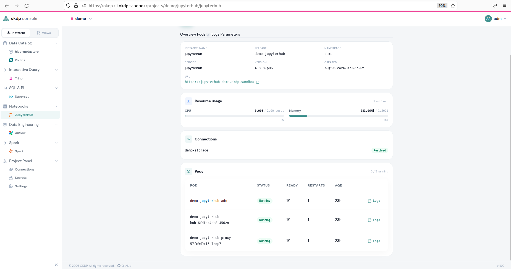

Les trois onglets situés en bas : `Deploy Notebook`, `View instances`, et `Manage Secrets` sont respectivement des raccourcis vers le déploiement de JupyterHub, le lancement de JupyterLab et la section de gestion des secrets.

En haut à gauche, vous avez le choix entre `Platform` et `Views`. Examinons d'abord `Plateform`, qui contient le catalogue de services et le `Project Panel`.

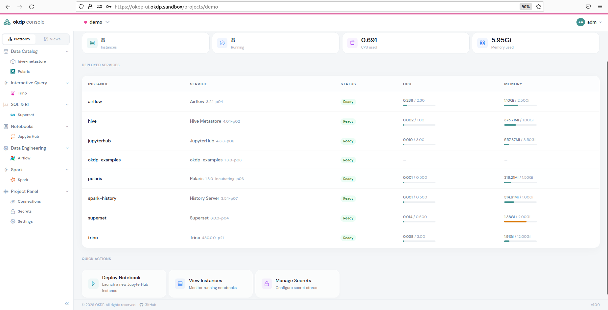

Le catalogue de services OKDP s'affiche dans la barre d'outils de gauche lorsque vous cliquez sur l'onglet `Plateform`. Il contient initialement les sections suivantes :

- Data Catalog
  - hive-metastore
  - Polaris
- Interactive Query
  - Trino
- SQL & BI
  - Superset
- Notebooks
  - JupyterHub
- Data Engineering
  - Airflow
- Spark
  - Spark History Server

Le service d'application Spark utilisant l'opérateur Spark n'apparaît pas ici dans le catalogue de services ; il est accessible depuis le tableau de bord `Views`.

Remarque : l'administrateur peut modifier le catalogue en ajoutant ou en supprimant un service ; ne soyez donc pas surpris si d'autres services y figurent ou, au contraire, n'y apparaissent pas.

## Panneau de projet

Le panneau de projet se trouve sous le catalogue de services et comprend les sections suivantes : `Connections`, `Secrets` et `Settings`.

La création ou la modification des `Connections` relève de la responsabilité d'un administrateur. Vous pouvez toutefois consulter les détails en cliquant sur la ligne correspondant à la connexion.

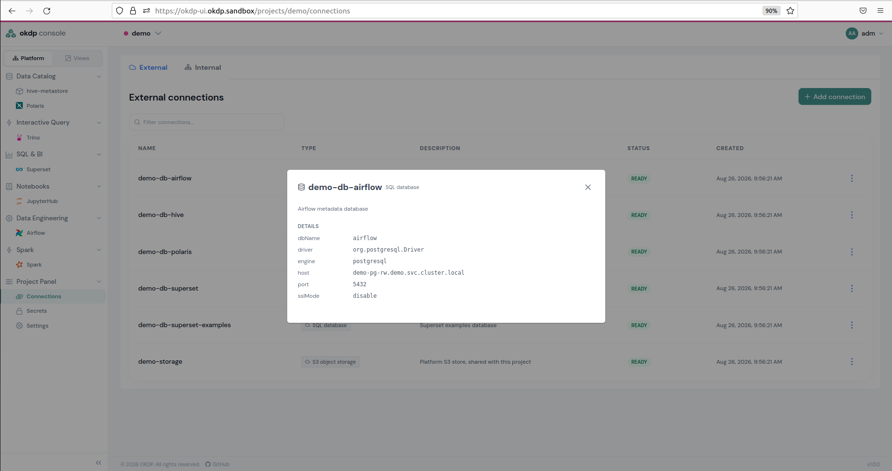

Dans la section `Parameters`, vous pouvez modifier la description et la couleur du projet, ainsi que le supprimer. De plus, vous avez la possibilité de créer des `Custom views`. Celles-ci permettent d’afficher un onglet dédié à un service ne faisant pas partie de l’offre de services de la plateforme OKDP.

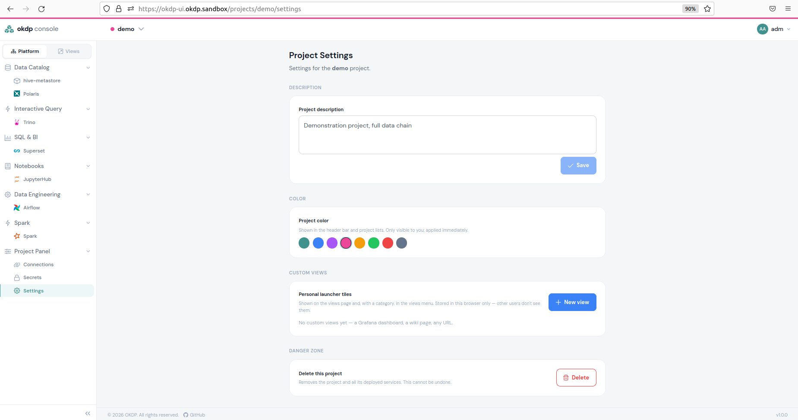

Pour créer une vue personnalisée, cliquez sur l'onglet `New view`, puis donnez un nom à la vue, ajoutez éventuellement une description, et choisissez une catégorie parmi les suivantes :

- `Lakehouse`
- `Data Engineering`
- `Notebooks`
- `SQL & BI`
- `Machine Learning`

Choisissez ensuite une icône. Si la case `Show in the views lateral menu` n'est pas cochée, la vue n'apparaîtra pas dans le menu principal, sous l'onglet `Views`.

Enfin, cliquez sur `Create`.

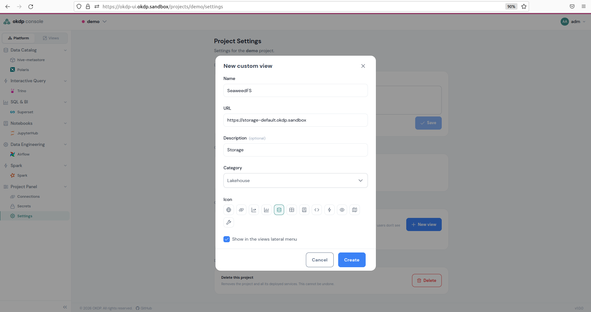

### Vues

Les vues permettent d’accéder aux interfaces utilisateur des services déployés, ainsi qu’aux services non OKDP ajoutés via l’option `Custom views` dans les catégories mentionnées ci-dessus.

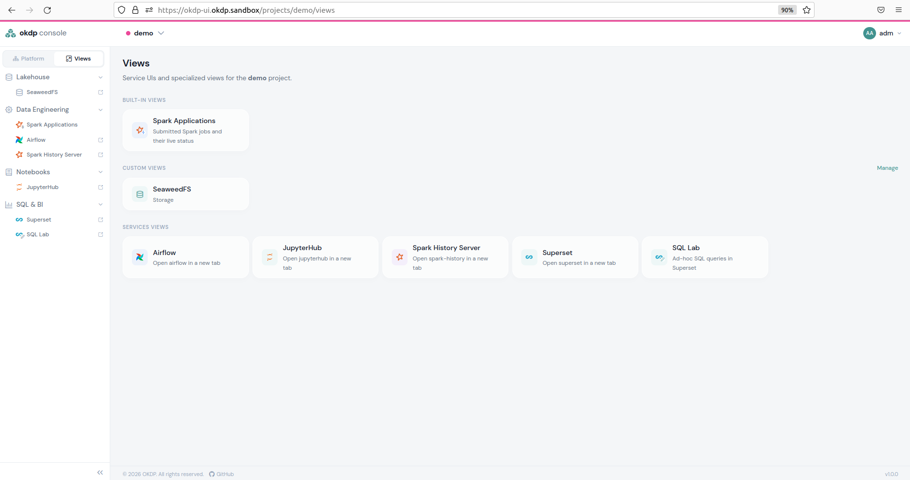

Si l’on clique sur l’icône SeaweedFS, créée précédemment, un onglet s’ouvre avec le navigateur de fichiers SeaweedFS.

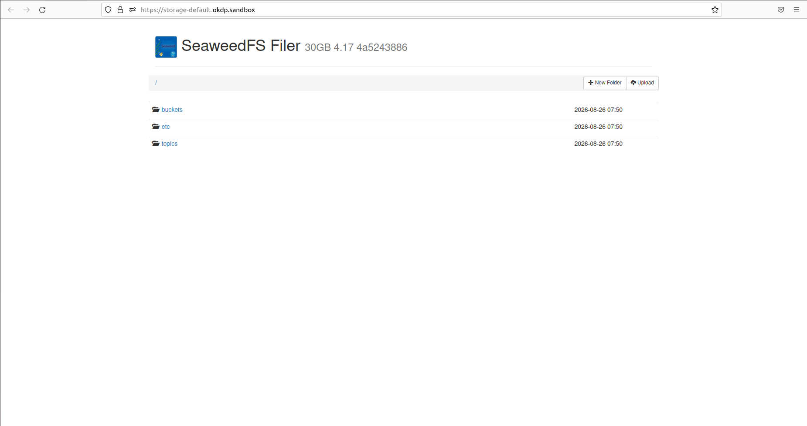

La vue `Spark Application` fait exception : elle ne mène pas à l’interface utilisateur de Spark, mais à une interface permettant d’écrire une application pour l’opérateur Spark.

## Utilisation d’un service

L’instanciation et la modification d’un service relèvent de la responsabilité des administrateurs, à l’exception d’Airflow, dont l’utilisation coïncide avec son déploiement. Sinon, nous décrivons ici comment utiliser un service déjà déployé. Toutefois, avant d’y accéder, assurez-vous que son statut est marqué comme `Ready`, ce qui signifie que tous ses pods, que vous pouvez voir en cliquant sur la petite icône en forme d’œil, sont au statut `Running`. Si ce n’est pas le cas, veuillez contacter votre administrateur pour remédier à la situation.

Chaque fois que vous voyez la petite icône en forme de fenêtre, celle-ci vous redirige vers l’interface utilisateur du service.

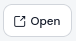

### JupyterHub

Si JupyterHub est déjà déployé, il faut lancer un JupyterLab pour accéder à un notebook.

Cliquez sur le bouton `Open` mentionné précédemment, soit dans la vue, soit dans la fenêtre de service affichée au début, et vous aurez le choix entre trois images.

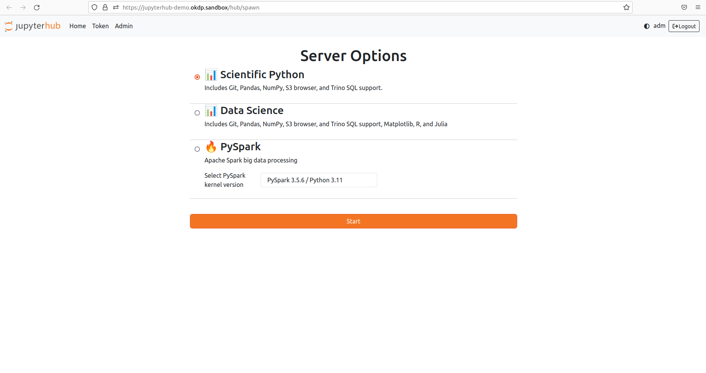

Sélectionnez l’un des notebooks. Si vous choisissez le notebook `PySpark`, vous pouvez également sélectionner la version du noyau PySpark/Python, puis cliquer sur `Start`. Une fois cette opération effectuée, un pod contenant l’image JupyterLab correspondante est lancé.

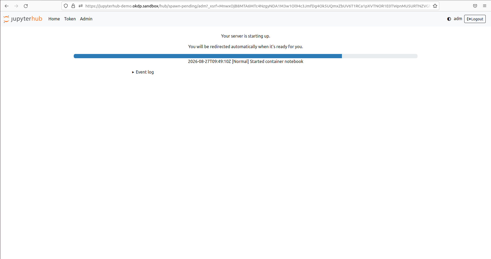

Vous avez enfin accès à votre notebook et pouvez désormais l’utiliser.

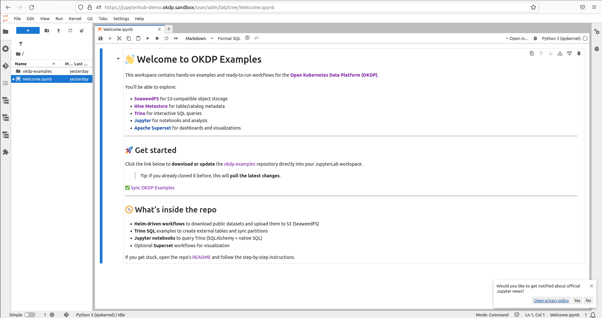

Le pod contenant votre JupyterLab lancé restera en cours d’exécution jusqu’à ce que vous cliquiez sur `Stop My Server` dans le menu du notebook, sous `File` -> `Hub Control Panel`. Vous devez également l’arrêter si vous souhaitez lancer un nouveau JupyterLab avec une autre image.

## Airflow

Airflow constitue un cas particulier, car l'exécution d'une tâche équivaut au déploiement d'un service.

Voici un exemple de déploiement utilisant les tâches du dépôt [okdp-examples](https://github.com/okdp/okdp-examples.git).

Accédez à la section `Data Engineering` du catalogue `Platform`, puis cliquez sur Airflow. Vous pouvez ensuite cliquer soit sur `New instance` au milieu, soit sur `Deploy` en haut à droite. Ces deux options mènent à la même page.

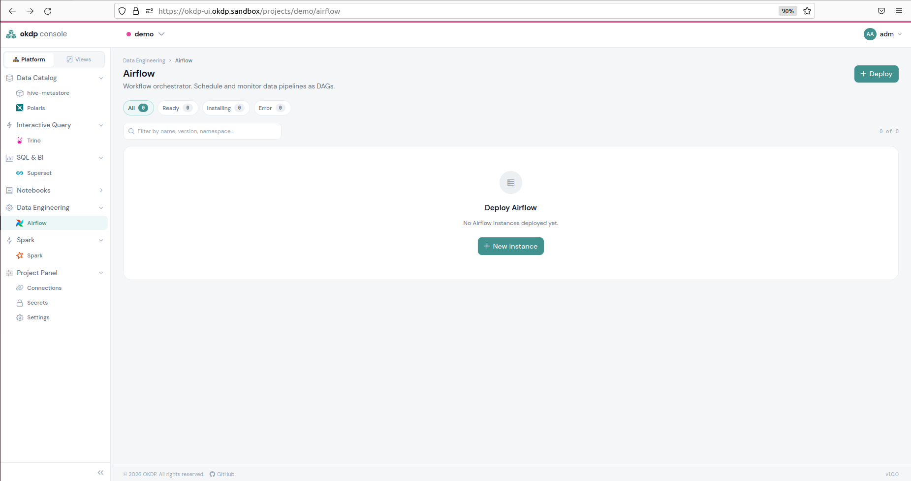

Choisissez un nom d’instance en minuscules et une version d’Airflow, puis cliquez sur `Next`.

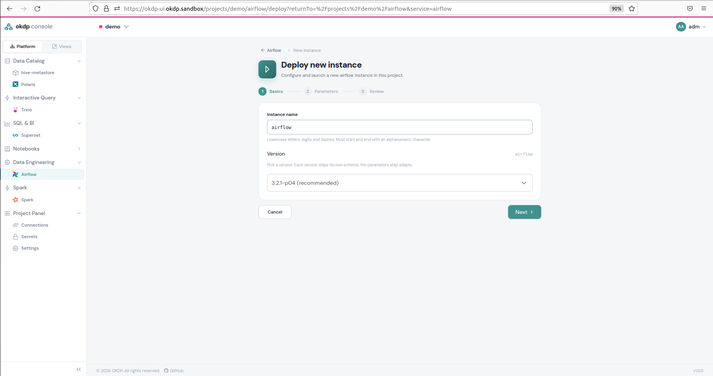

Choisissez une connexion à une base de données. Si celle-ci n’existe pas, vous pouvez la créer en cliquant sur `+ Nouvelle connexion` ; toutefois, la procédure de création relève de la responsabilité de votre administrateur. Configurez ensuite le DAG avec les paramètres de synchronisation Git.

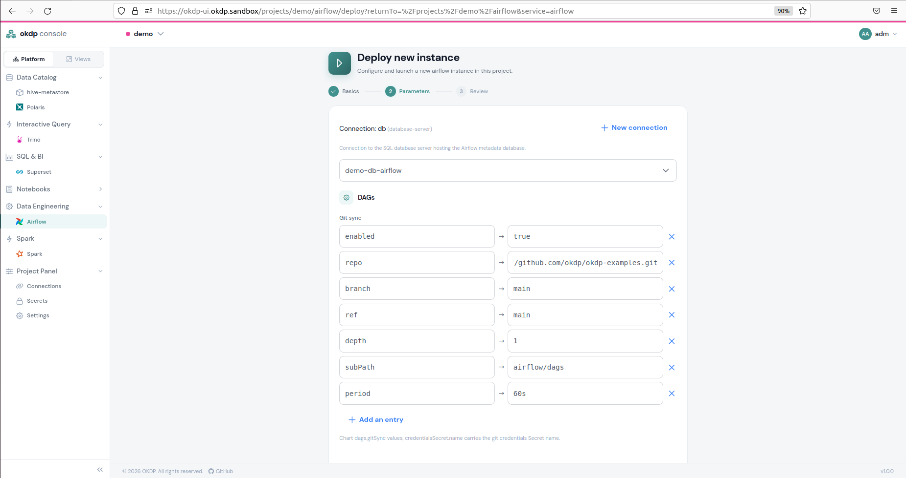

Si vous souhaitez modifier la configuration, vous pouvez saisir des valeurs différentes pour la mémoire du planificateur et du serveur web. Saisissez ensuite le nom du secret Kubernetes contenant les identifiants de connexion à la base de données. En tant qu’utilisateur lambda, vous ne saurez pas quel nom de secret saisir ici. Veuillez contacter votre administrateur pour qu’il vous fournisse ces informations. Enfin, vous pouvez saisir certaines clés et valeurs pour le mappage des rôles OIDC du job Airflow, qui devraient également vous être fournies par votre administrateur, puis cliquer sur `Next`.

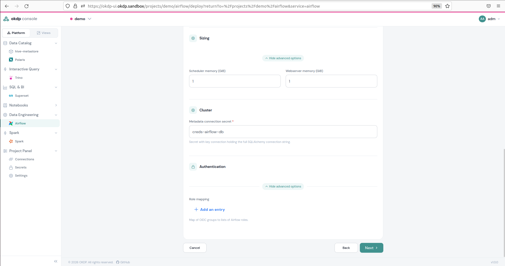

Vous disposez alors d'un récapitulatif du déploiement. Cliquez sur `Deploy instance` pour lancer le déploiement.

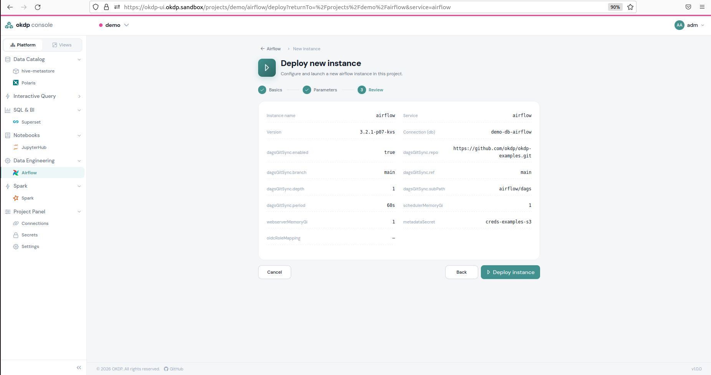

Vous êtes désormais redirigé vers la page de l'instance du service Airflow. Pour obtenir plus de détails, vous pouvez cliquer sur la ligne contenant les informations.

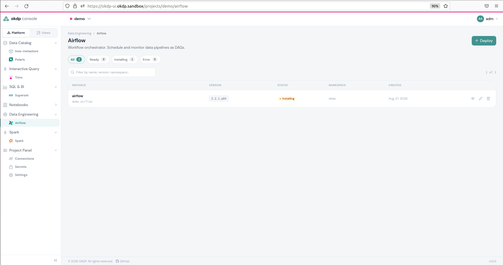

Vérifiez que le statut est en mode `Ready`. Si ce n’est pas le cas, vous pouvez consulter les journaux en cliquant sur l’icône en forme d’œil, puis sur le bouton `Logs` des pods qui ne sont pas en statut `Running`. Si ce n’est pas le cas, vous pouvez accéder à l’interface utilisateur en cliquant sur l’icône en forme de fenêtre.

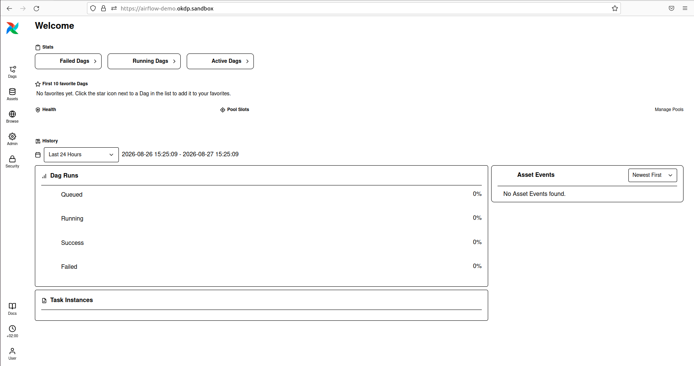

## Application Spark

OKDP intègre l'opérateur Spark, bien qu'il n'apparaisse pas dans le catalogue de services sous l'onglet `Plateform`. Il est toutefois accessible sous l'onglet `Views`, dans la section `Data Engineering`. Il s'agit également d'une vue intégrée, visible au centre du tableau de bord.

Après avoir cliqué sur l’une des icônes mentionnées, vous pouvez lancer une application Spark en remplissant les champs suivants si vous vous trouvez dans la section `Guided`, puis en cliquant sur `Submit`.

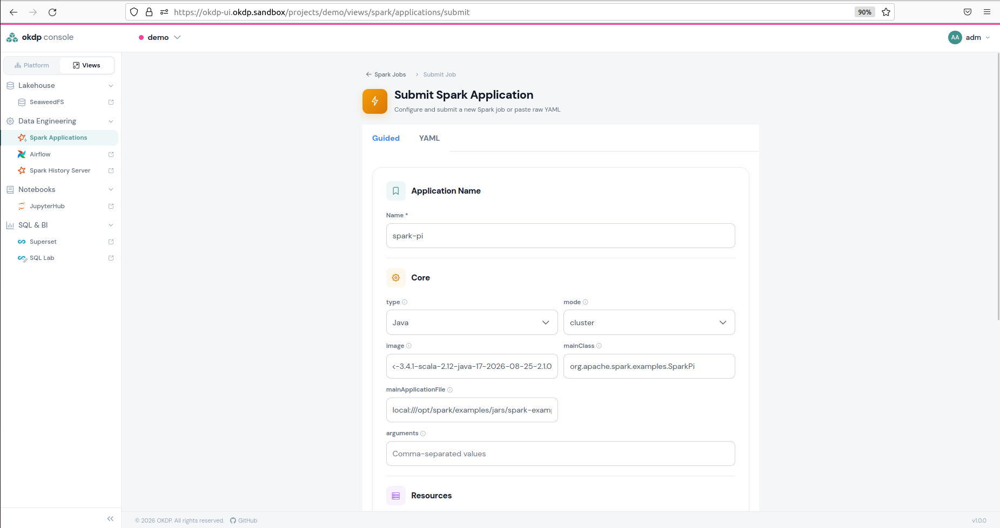

Faites défiler vers le bas pour définir les ressources du pilote et de l’exécuteur ainsi que toute configuration Spark supplémentaire, puis cliquez sur `Submit` :

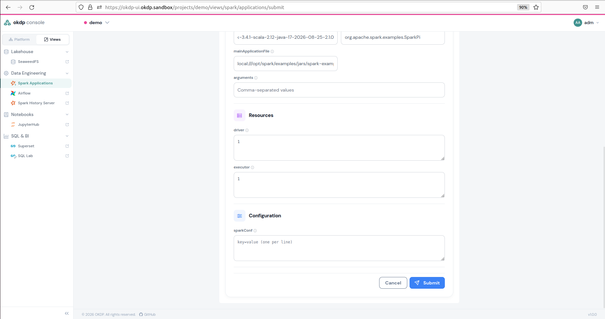

Vous pouvez également effectuer la même opération en collant l’application Spark au format YAML, comme indiqué ci-dessous, dans la section `YAML`, puis en cliquant sur `Submit YAML`.

```yaml
apiVersion: sparkoperator.k8s.io/v1beta2
kind: SparkApplication
metadata:
  labels:
    okdp.io/project: demo
  name: spark-pi
  namespace: demo
spec:
  driver:
    cores: 1
    memory: 1g
  executor:
    cores: 1
    instances: 1
    memory: 1g
  image: quay.io/okdp/spark:spark-3.4.1-scala-2.12-java-17-2026-08-25-2.1.0
  mainApplicationFile: local:///opt/spark/examples/jars/spark-examples_2.12-3.4.1.jar
  mainClass: org.apache.spark.examples.SparkPi
  mode: cluster
  restartPolicy:
    type: Never
  timeToLiveSeconds: 3600
  type: Java
```

Vous pouvez suivre l'état de l'application à l'écran et vérifier qu'elle apparaît en bleu avec la mention `Succeeded` après avoir affiché le statut `Running` en vert.

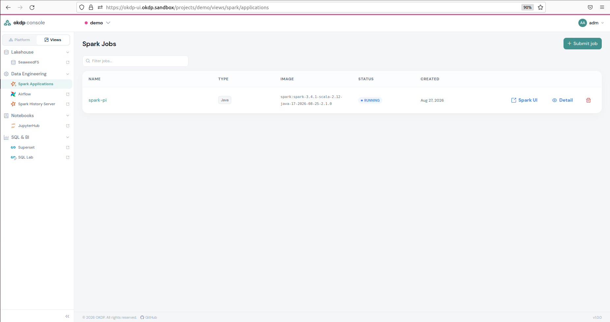

Si elle reste à l’état `Running` ou à tout autre état, consultez les détails et les journaux en cliquant sur l’icône en forme d’œil à côté de `Detail`.

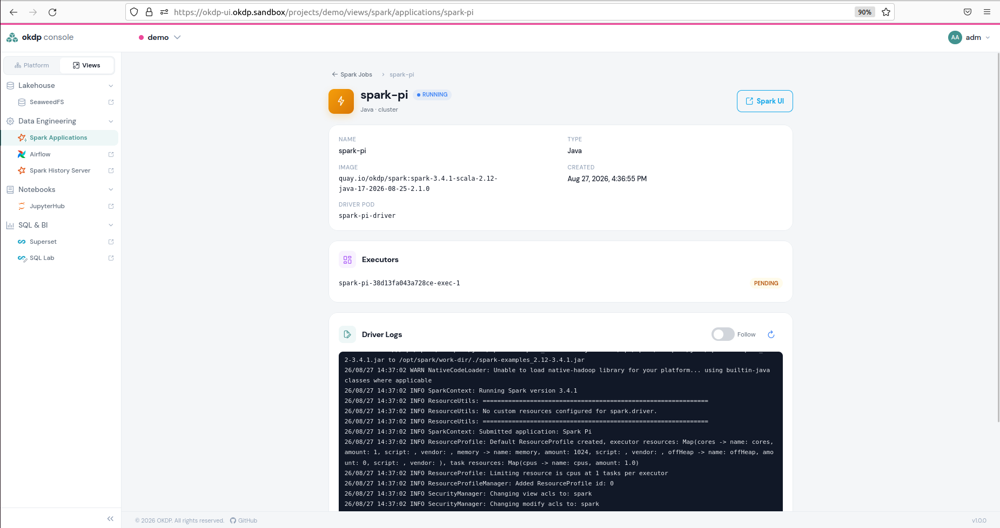

### Autres services accessibles via leur interface utilisateur

L'utilisation de Polaris ou de Superset s'effectue via leur propre interface utilisateur. Vous y accédez en cliquant sur la petite icône en forme de fenêtre mentionnée précédemment.
